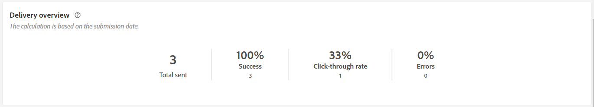

# 推送投放报告 {#push-report}

>[!CONTEXTUALHELP]
>id="acw_push_report_overview"
>title="推送报告摘要"
>abstract="探索您的推送投放的报告指标。"

此 **推送投放报告** 提供了推送渠道的全面概述，提供了广泛的见解和特定数据。 它提供了有关每次投放的表现、效果和结果的全面信息。

## 推送摘要 {#push-summary}

* **[!UICONTROL 投放概述]** 提供关键绩效指标(KPI)，用于提供有关访客如何参与推送消息的详细信息。

  

  +++了解有关推送投放报告量度的更多信息。

   * **[!UICONTROL 发送总数]**：投放分析期间处理的消息总数。

   * **[!UICONTROL 已投放]**：成功发送的消息数，与已发送消息的总数相关。

   * **[!UICONTROL 点击次数]**：与推送消息交互的收件人总数。

   * **[!UICONTROL 错误]**：投放期间发生的阻止将投放发送到用户档案的错误总数。

+++

* **目标人群** 图表和表格显示与受众相关的数据：

  

  +++了解有关推送投放报告量度的更多信息。

   * **[!UICONTROL 交付]**：投放分析期间处理的消息总数。

   * **[!UICONTROL 排除项]**：已从分析中排除的用户档案数。

+++

* **总体统计信息** 显示已发送推送通知的数据，包括：

  

  +++了解有关推送投放报告量度的更多信息。

   * **[!UICONTROL 成功]**：成功处理的消息数。

   * **[!UICONTROL 错误]**：投放期间发生的阻止将消息发送到特定用户档案的错误总数。

   * **[!UICONTROL 新建隔离]**：已排除并添加到隔离的用户档案数。

+++

* **[!UICONTROL 排除项]** 图表和表格显示了阻止用户配置文件（已从目标配置文件中排除）接收消息的各种原因。

  

## 投放吞吐量 {#delivery-throughput}

此报表提供有关指定时间范围内整个平台的投放吞吐量的详细信息。 用于测量消息投放速度的主要指标是每小时发送的消息数。

