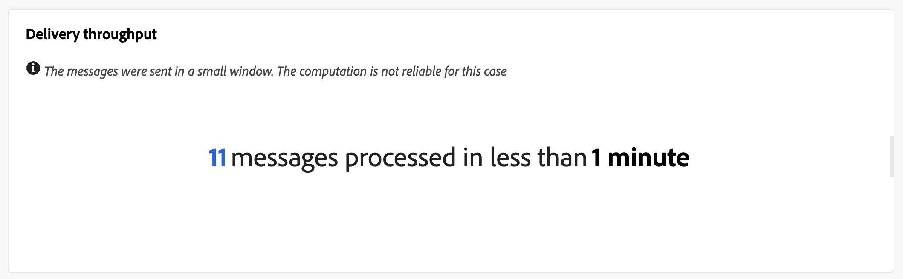

# 推送投放报告 {#push-report}

>[!CONTEXTUALHELP]
>id="acw_push_report_overview"
>title="推送投放报告摘要"
>abstract="此 **推送投放概述** 提供了推送投放的全面概述，其中包含大量洞察和特定数据。 它提供有关投放的性能、效果和结果的全面信息。"

>[!CONTEXTUALHELP]
>id="acw_delivery_reporting_sending_push"
>title="报告发送"
>abstract="他 **正在发送** 使用报表中的制表符，可深入分析访客与投放的交互情况以及他们可能遇到的任何潜在错误。"

此 **推送投放报告** 提供了推送渠道的全面概述，提供了大量见解和特定数据。 它提供了有关每次投放的表现、效果和结果的全面信息。

## 推送摘要 {#push-summary}

### 投放概述 {#push-delivery-overview}

此 **[!UICONTROL 投放概述]** 报告提供关键绩效指标(KPI)，提供关于访客如何参与推送消息的详细信息。

+++了解有关推送投放报告量度的更多信息。

* **[!UICONTROL 发送总数]**：投放准备期间处理的消息总数。

* **[!UICONTROL 已投放]**：成功发送的消息数，与已发送消息的总数相关。

* **[!UICONTROL 点击次数]**：与推送消息交互的收件人总数。

* **[!UICONTROL 错误]**：投放期间发生并阻止将其发送到用户档案的错误总数。

+++

### 目标群体 {#push-delivery-targeted-population}

>[!CONTEXTUALHELP]
>id="acw_delivery_reporting_push_targeted_population"
>title="推送目标人群"
>abstract="此 **目标人群** 图形和表格显示与推送消息受众相关的数据：要投放的消息和排除项。"

此 **目标人群** 图表和表格显示与受众相关的数据：要投放的消息和排除项。 指标详见下文。

+++了解有关推送投放报告量度的更多信息。

* **[!UICONTROL 投放]**：投放准备期间处理的消息总数。

* **[!UICONTROL 排除项]**：已从分析中排除的用户档案数。

+++

### 总体统计信息 {#push-delivery-overall}

>[!CONTEXTUALHELP]
>id="acw_delivery_reporting_push_overall_stats"
>title="推送整体统计信息"
>abstract="此 **总体统计信息** 报表呈现已发送推送通知的数据：成功、错误和隔离。"

此 **总体统计信息** 报表呈现已发送推送通知的数据：成功、错误和隔离。 指标详见下文。

+++了解有关推送投放报告量度的更多信息。

* **[!UICONTROL 成功]**：成功处理的消息数。

* **[!UICONTROL 错误]**：投放期间发生阻止将消息发送到特定用户档案的错误总数。

* **[!UICONTROL 新隔离]**：已排除并添加到隔离中的用户档案数。

+++

### 排除项 {#push-delivery-exclusions}

>[!CONTEXTUALHELP]
>id="acw_delivery_reporting_push_exclusions"
>title="推送整体统计信息"
>abstract="此 **排除项** 图形和表格可显示阻止用户配置文件（已从目标配置文件中排除）接收消息的各种原因。"

此 **[!UICONTROL 排除项]** 图形和表格可显示阻止用户配置文件（已从目标配置文件中排除）接收消息的各种原因。

## 投放吞吐量 {#delivery-throughput}

>[!CONTEXTUALHELP]
>id="acw_delivery_reporting_throughput_push"
>title="投放吞吐量报表"
>abstract="投放吞吐量报表显示有关指定时间范围内整个平台的投放吞吐量的详细信息。"

此 **投放吞吐量** 报告提供指定时间范围内整个平台的投放吞吐量的详细信息。 用于测量消息投放速度的主要指标是每小时发送的消息数。

