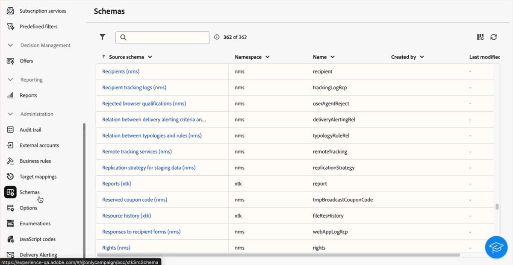

# 2025 年发行说明 {#2025-release}

本页列出了 **2025 年版本**&#x200B;的所有变更和改进。最新发布说明可在 [此页面](release-notes.md)中查看。

## 2025 年 10 月版本 {#25-10-updates}

_2025 年 11 月 3 日_

<table>
<thead>
<tr>
<th><strong>事务性消息、推送通知和短信（LA）的多语言功能</strong> </th> 
</tr>
</thead>
<tbody>
<tr>
<td>

您现在可以在 Adobe Campaign Web 用户界面中以不同语言发送多条事务性消息、推送通知和短信消息。多语言投放功能允许您选择投放的默认语言以及可以发送投放的不同语言。您还可以使用您选择的语言预览这些投放内容。

注释：此功能目前仅面向部分组织开放（限量发布版），将在未来版本中逐步向全球推广。

有关更多信息，请参阅<a href="../msg/multilingual.md">详细文档</a>。

</td>
</tr>
</tbody>
</table>

<!--
* Enable OOTB File Upload for Multi-lingual Push Notification Deliveries. 
-->

<table>
<thead>
<tr>
<th><strong>事务性消息中的轮廓扩充（LA）</strong> </th> 
</tr>
</thead>
<tbody>
<tr>
<td>

此功能允许您通过将 Adobe Campaign 数据库字段链接到消息内容来个性化事务性消息。您可以选择目标映射、扩充列和协调键，以确保准确、实时的个性化，同时保持性能阈值。

注释：此功能目前仅面向部分组织开放（限量发布版），将在未来版本中逐步向全球推广。此功能目前仅适用于电子邮件。

有关更多信息，请参阅<a href="../transactional-messaging/profile-enrichment.md">详细文档</a>。

</td>
</tr>
</tbody>
</table>

<table>
<thead>
<tr>
<th><strong>与 Adobe GenStudio 集成</strong> </th>
</tr>
</thead>
<tbody>
<tr>
<td>

为提升营销效率并保持品牌一致性，您现在可以将 GenStudio for Performance Marketing 体验与 Campaign 无缝集成。这使您能够结合使用 GenStudio 的 AI 驱动内容创作功能与 Campaign 的高级编排能力。

有关更多信息，请参阅<a href="../integrations/genstudio.md">详细文档</a>。

</td>
</tr>
</tbody>
</table>

<table>
<thead>
<tr>
<th><strong>电子邮件设计器中的深色模式支持</strong> </th> 
</tr>
</thead>
<tbody>
<tr>
<td>

电子邮件设计器现已支持切换至深色模式视图，您还可以在该模式下定义特定的自定义设置。请注意，电子邮件的最终呈现效果取决于收件人的电子邮件客户端，并非所有电子邮件客户端都支持深色模式。

有关更多信息，请参阅<a href="../email/dark-mode.md">详细文档</a>。

</td>
</tr>
</tbody>
</table>

<!-- table>
<thead>
<tr>
<th><strong>Continuous delivery activity</strong> </th> not ready
</tr>
</thead>
<tbody>
<tr>
<td>

Continuous delivery activity

For more information, refer to the detailed documentation.

</td>
</tr>
</tbody>
</table-->

### 改进 {#25-10-improvements}

* 在客户端控制台中创建的投放中，**受众**&#x200B;部分现在会显示是否已为校样目标定义动态条件。<!-- [Learn more](../msg/gs-deliveries.md#access)-->

* 使用电子邮件设计器的条件内容功能设置条件时，您现在可以在新版规则生成器与旧版规则生成器之间切换。<!-- [Learn more](../personalization/conditions.md#condition-condition-builder)-->

* 您现在可以在收件人架构的屏幕定义中选择收藏集链接，例如购买记录。这样可通过专用选项卡在轮廓界面中显示相关数据。<!-- [Learn more](../administration/schemas.md)-->

* 作为 Campaign 管理员，您现在可以设置与 Salesforce CRM 和 Microsoft Dynamics 的连接。
  [了解详情](../administration/external-crm.md)

<!--
* Stop button for deliveries not linked to release and no info
-->

## 2025 年 9 月版 {#25-9-release}

_2025 年 9 月 23 日_

以下功能自 9 月版本起提供。

<table>
<thead>
<tr>
<th><strong>用于 API 投放的自定义渠道</strong> </th>
</tr>
</thead>
<tbody>
<tr>
<td>

您现在可以直接从 Adobe Campaign Web UI 基于自定义 API 渠道来编排和执行投放。这些投放既可以独立执行，也可以作为工作流的一部分。自定义 API 渠道的配置需在控制台中完成。

有关更多信息，请参阅<a href="../call-center/gs-custom-channel.md">详细文档</a>。

</td>
</tr>
</tbody>
</table>

<table>
<thead>
<tr>
<th><strong>外部帐户创作</strong> </th>
</tr>
</thead>
<tbody>
<tr>
<td>

作为 Campaign 管理员，您现在可以从 Campaign Web 用户界面建立与外部系统的新连接。您还可以查看、更新和管理现有的外部帐户。

有关更多信息，请参阅<a href="../administration/create-external-account.md">详细文档</a>。

</td>
</tr>
</tbody>
</table>

<table>
<thead>
<tr>
<th><strong>电子邮件内容锁定</strong> </th>
</tr>
</thead>
<tbody>
<tr>
<td>

Campaign 现在支持在电子邮件模板中锁定内容，您可以选择锁定整个模板，或仅锁定特定结构和组件。这可帮助您防止内容被误编辑或误删除，从而更好地掌控模板定制，并提升电子邮件营销活动的效率与可靠性。

有关更多信息，请参阅<a href="../content/content-locking.md">详细文档</a>。

</td>
</tr>
</tbody>
</table>

<!--table>
<thead>
<tr>
<th><strong>Integration with Adobe GenStudio</strong> </th>  LA? sort? Juliette
</tr>
</thead>
<tbody>
<tr>
<td>

To enhance marketing efficiency and to maintain brand consistency, you can now seamlessly integrate GenStudio for Performance Marketing experiences with Campaign. This enables you to leverage GenStudio's AI-power content creation alongside Campaign's advanced orchestration capabilities.

For more information, refer to the detailed documentation.

</td>
</tr>
</tbody>
</table-->

<!--table>
<thead>
<tr>
<th><strong>Dark mode support in the Email designer</strong> </th> -> pas sept, modifier composant... -> Juliette
</tr>
</thead>
<tbody>
<tr>
<td>

The Email Designer now offers the ability to switch to dark mode view, where you can additionally define specific custom settings. Note that the final rendering depends on the recipient's email client, and not all email clients support dark mode.

For more information, refer to the detailed documentation.

</td>
</tr>
</tbody>
</table-->

<!--table>>
<thead>
<tr>
<th><strong>Multilingual capabilities for transactional messaging and push notifications (LA)</strong> </th> 
</tr>
</thead>
<tbody>
<tr>
<td>

You can now send multiple transactional messages and push notifications in different languages in Adobe Campaign Web User Interface. The Multilingual delivery feature allows you to choose the default language of your delivery as well as the different languages in which the delivery can be sent. You can also preview these deliveries in the languages you have chosen.

Note: this capability is only available for a set of organizations (Limited Availability), and will be rolled out globally in a future release.

For more information, refer to the detailed documentation.

</td>
</tr>
</tbody>
</table-->

<!--table>
<thead>
<tr>
<th><strong>Profile enrichment in Transactional Messages (LA)</strong> </th> 
</tr>
</thead>
<tbody>
<tr>
<td>

This capability allows you to personalize transactional messages (Email, SMS, Push) by linking Adobe Campaign database fields to the message content. You can select target mappings, enrichment columns, and a reconciliation key to ensure accurate, real-time personalization while maintaining performance thresholds.

Note: this capability is only available for a set of organizations (Limited Availability), and will be rolled out globally in a future release.

For more information, refer to the detailed documentation.

</td>
</tr>
</tbody>
</table-->

<!--table>
<thead>
<tr>
<th><strong>Dynamic reporting for transactional messaging (LA)</strong> </th> 
</tr>
</thead>
<tbody>
<tr>
<td>

Note: this capability is only available for a set of organizations (Limited Availability), and will be rolled out globally in a future release.

For more information, refer to the detailed documentation.

</td>
</tr>
</tbody>
</table-->

### 改进 {#25-9-improvements}

* 在使用电子邮件设计器的条件内容功能设置条件时，新增了一组运算符可供使用。
* 过滤维度现已在&#x200B;**构建受众**&#x200B;工作流活动中可用。要查看或更改，请单击目标维度旁边的图标。[了解详情](../workflows/activities/build-audience.md#build-audience-configuration)。
<!--

NEO-84915 Stop button for deliveries???? ->>> met pas, juste bouton ajouté dans webUI meme comportement que console. bleu, marche, marche pas.
NEO-90345 WebUI - Extended operators for dynamic content ->>>> deja mis
NEO-88858 WebUI - Send proof from execution recurring delivery -> bug
NEO-89777 Content locking on create email template -> juliette
NEO-90365 Multi-lingual – Identify fields editable from variants???? -> fix pour SMS
query activity -> query ds workflow fitleting dimentsion 

-->

## 2025 年 8 月版本 {#25-8-release}

此版本包含一系列错误修复，包括：

* 已改进轮廓的复制流程，使其与客户端控制台的行为保持一致，从而确保在两个界面中的体验一致。此修复解决了可能导致无法创建复制轮廓的问题。

* 在投放配置界面中的 **[!UICONTROL 电子邮件 BCC]** 选项现已支持 Momentum（增强型 MTA）。此功能以前仅在客户端控制台中可用。

## 2025 年 7 月版 {#25-7-release}

### 新增功能 {#25-7-features}

自 7 月版本开始可以使用以下功能。

<!--table>
<thead>
<tr>
<th><strong>Multilingual email and SMS</strong> </th>
</tr>
</thead>
<tbody>
<tr>
<td>

You can now send multiple email and SMS deliveries in different languages in Adobe Campaign Web UI. The multilingual delivery feature allows you to choose the default language of your delivery as well as the different languages in which the delivery can be sent. You can also preview these deliveries in the languages you have chosen.

For Multilingual email, your server must be upgraded to 8.8.1 minimum. Refer to the Client Console <a href="https://experienceleague.adobe.com/docs/campaign/campaign-v8/releases/release-notes.html?lang=zh-Hans" target="_blank">release notes</a>.

For more information, refer to the <a href="../email/edit-content.md#multilingual-delivery">detailed documentation</a>.

</td>
</tr>
</tbody>
</table-->

<!--table>
<thead>
<tr>
<th><strong>Custom channel for API deliveries</strong> </th>
</tr>
</thead>
<tbody>
<tr>
<td>

You can now, directly from Adobe Campaign Web UI, orchestrate and execute deliveries based on custom API channels. These deliveries can be standalone or part of a workflow. The configuration of the custom API channel is performed in the console.

For more information, refer to the detailed documentation.

</td>
</tr>
</tbody>
</table-->

<table>
<thead>
<tr>
<th><strong>电子邮件设计器中支持自定义 CSS</strong> </th>
</tr>
</thead>
<tbody>
<tr>
<td>

在设计电子邮件时，您现在可以在电子邮件设计器中直接添加自己的自定义 CSS。此功能使您能够应用高级和特定的样式，从而更灵活、更好地控制您的内容外观。

有关更多信息，请参阅<a href="../email/custom-css.md">详细文档</a>。

</td>
</tr>
</tbody>
</table>

<table>
<thead>
<tr>
<th><strong>品牌</strong> </th>
</tr>
</thead>
<tbody>
<tr>
<td>

您现在可以创建并自定义您的品牌，在所有宣传中清晰传达您的视觉风格与语言特征。通过品牌一致性评分，您可以实时获得内容是否符合品牌语调、风格和规范的反馈，帮助您在每一次沟通中始终保持品牌一致性。

有关更多信息，请参阅<a href="../content/brands.md">详细文档</a>。

</td>
</tr>
</tbody>
</table>

<table>
<thead>
<tr>
<th><strong>投放警报</strong> </th>
</tr>
</thead>
<tbody>
<tr>
<td>

投放警报功能是一个警报管理系统，利用该系统可让一组用户自动接收包含其投放执行信息的通知。

有关更多信息，请参阅<a href="../msg/delivery-alerting.md">详细文档</a>。

</td>
</tr>
</tbody>
</table>

<!--table>
<thead>
<tr>
<th><strong>Landing pages improvements</strong> </th>
</tr>
</thead>
<tbody>
<tr>
<td>

The following improvements to landing pages are now available:

<ul>
    <li>You can now reference a default subscription/unsubscription landing page when configuring a service. When designing an email, if you define a link to that landing page, users submitting the landing page form are automatically subscribed to or unsubscribed from this service. <a href="../audience/manage-services.md#create-service">Read more</a></li>
    <li>A new option in the landing page configuration allows anonymous visitors to access the landing page. If you unselect this option, only identified users can access and submit the form. <a href="../landing-pages/create-lp.md#create-landing-page">Read more</a></li>
    <li>A new option in the landing page configuration allows to store additional internal data when the landing page is being submitted. <a href="../landing-pages/create-lp.md#create-landing-page">Read more</a></li>
    <li>A new option enables to use a landing page for several services, making it dynamic. When adding a link to an email, if you select a dynamic landing page, you can select any service. If you select a landing page that has a specific service associated, this service will be automatically used (you cannot select another one). <a href="../landing-pages/create-lp.md#define-actions-on-form-submission">Read more</a></li>
    <li>Conditional content is now supported in landing pages. <a href="../landing-pages/lp-content.md">Read more</a></li>
    <li>You can link a landing page to a service, and send a confirmation message when users validate it. <a href="../landing-pages/lp-content.md#lp-message">Read more</a></li>
    <li>You can add captcha to protect your landing page from spam and abuse caused by bots. This is non-intrusive for your customers since it does not require any interaction from them and is based on interactions with your site. <a href="../landing-pages/create-lp.md#captcha">Read more</a></li>
</ul>
</td>
</tr>
</tbody>
</table-->

<table>
<thead>
<tr>
<th><strong>动态报告</strong> </th>
</tr>
</thead>
<tbody>
<tr>
<td>

您现在可以使用动态报告功能，该功能提供完全可自定义的实时报告，以衡量您的营销活动成效。它增加了对轮廓数据的访问，除打开数和点击数等功能性电子邮件营销活动数据外，还支持按轮廓维度（如性别、城市和年龄）进行人口统计分析。动态报告现也适用于多语言电子邮件投放和事务性消息。

此功能仅按需提供。要获得访问权限，请与 Adobe 代表联系。您的服务器必须至少升级到 8.8.1 版。请参阅客户端控制台<a href="https://experienceleague.adobe.com/docs/campaign/campaign-v8/releases/release-notes.html?lang=zh-Hans" target="_blank">发行说明</a>。

有关更多信息，请参阅<a href="../reporting/dynamic-reporting/get-started-reporting.md">详细文档</a>。

</td>
</tr>
</tbody>
</table>

<table>
<thead>
<tr>
<th><strong>集中品牌化</strong> </th>
</tr>
</thead>
<tbody>
<tr>
<td>

您的技术管理员现在可以定义一个或多个品牌，以集中管理影响品牌形象的相关参数。其中包括品牌徽标、登陆页面访问 URL 的域名或消息跟踪设置。您可以创建这些品牌并将它们链接到消息或登陆页面。此配置在模板中进行管理。品牌化选项现在可用于所有渠道，包括短信和直邮。

此功能仅针对新实施按需提供。要获得访问权限，请与 Adobe 代表联系。您的服务器必须至少升级到 8.8.1 版。请参阅客户端控制台<a href="https://experienceleague.adobe.com/docs/campaign/campaign-v8/releases/release-notes.html?lang=zh-Hans" target="_blank">发行说明</a>。

有关更多信息，请参阅<a href="../administration/branding/branding-gs.md">详细文档</a>。

</td>
</tr>
</tbody>
</table>

除上述功能外，本次版本还提供了一组可在客户端控制台中使用的功能：

* [新的短信发送连接器](https://experienceleague.adobe.com/docs/campaign/campaign-v8/send/sms/sms.html?lang=zh-Hans)（FDA 环境）
* [Rest API](https://experienceleague.adobe.com/docs/campaign/campaign-v8/developer/apis/get-started-apis.html?lang=zh-Hans)（按需，FDA 环境）

请参阅客户端控制台[发行说明](https://experienceleague.adobe.com/docs/campaign/campaign-v8/releases/release-notes.html?lang=zh-Hans){target="_blank"}。

<!--

### Features previously in Limited Availability {#25-7-limited} 

>[!AVAILABILITY]
>
>To benefit from these updates, your server must be upgrated to 8.8.1 mininum. Refer to the Client Console [release notes](https://experienceleague.adobe.com/docs/campaign/campaign-v8/releases/release-notes.html?lang=zh-Hans){target="_blank"}.

Previously released in Limited Availability, the following capabilities are now available to all environments (General Availability):

* **Multilingual delivery creation** - You can now send multiple email deliveries in different languages in Adobe Campaign Web User Interface. The Multilingual delivery feature allows you to choose the default language of your delivery as well as the different languages in which the delivery can be sent. You can also preview these deliveries in the languages you have chosen. [Read more](../email/edit-content.md#multilingual-delivery).

* **Visual fragments** - You can now create, use and archive content fragments. Visual fragments are pre-defined visual blocks that you can reuse across multiple email deliveries, or in content templates. [Learn more](https://experienceleague.adobe.com/docs/campaign-web/v8/content/manage-reusable-content/fragments/fragments.html?lang=zh-Hans){target="_blank"}

* **Delivery alerting** - The Delivery alerting feature is an alert management system that enables a group of users to automatically receive notifications containing information on the execution of their deliveries. [Read more](../msg/delivery-alerting.md)

* **Landing pages improvements** - The following improvements to landing pages are now available:

    * You can now reference a default subscription/unsubscription landing page when configuring a service. When designing an email, if you define a link to that landing page, users submitting the landing page form are automatically subscribed to or unsubscribed from this service. [Read more](../audience/manage-services.md#create-service)
    * A new option in the landing page configuration allows anonymous visitors to access the landing page. If you unselect this option, only identified users can access and submit the form. [Read more](../landing-pages/create-lp.md#create-landing-page)
    * A new option in the landing page configuration allows to store additional internal data when the landing page is being submitted. [Read more](../landing-pages/create-lp.md#create-landing-page)
    * A new option enables to use a landing page for several services, making it dynamic. When adding a link to an email, if you select a dynamic landing page, you can select any service. If you select a landing page that has a specific service associated, this service will be automatically used (you cannot select another one). [Read more](../landing-pages/create-lp.md#define-actions-on-form-submission)
    * Conditional content is now supported in landing pages. [Read more](../landing-pages/lp-content.md)
    * You can link a landing page to a service, and send a confirmation message when users validate it. [Learn more](../landing-pages/lp-content.md#lp-message)
    * You can add captcha to protect your landing page from spam and abuse caused by bots. This is non-intrusive for your customers since it does not require any interaction from them and is based on interactions with your site. [Learn more](../landing-pages/create-lp.md#captcha)

Previously released in Limited Availability, the following capabilities are now available **on demand**:

* **Dynamic Reporting** - You can now access Dynamic Reporting which provides fully customizable and real-time reports to measure the impact of your marketing activities. It adds access to profile data, enabling demographic analysis by profile dimensions such as gender, city and age in addition to functional email campaign data like opens and clicks. Dynamic reporting is also available for multilingual email deliveries and transactional messages. [Read more](../reporting/dynamic-reporting/get-started-reporting.md)

* **Centralized Branding** -  Your technical administrators can now define one or several brands to centralize the parameters that affect a brand's identity. This includes the brand logo, the domain of the landing pages' access URL, or message tracking settings. You can create these brands and link them to messages or landing pages. This configuration is managed in templates. Branding options are available for all channels, including SMS and Direct mail. [Read more](../administration/branding/branding-gs.md){target="_blank"}

    >[!NOTE]
    >
    >This feature is only available for new implementations.

In addition to the features listed above, this release also comes with a set of functionalities available in the Client Console:

* [New SMS sending connector](https://experienceleague.adobe.com/docs/campaign/campaign-v8/send/sms/sms.html?lang=zh-Hans) (FDA environments)
* [Rest APIs](https://experienceleague.adobe.com/docs/campaign/campaign-v8/developer/apis/get-started-apis.html?lang=zh-Hans) (on demand, FDA environments)

Refer to the Client Console [release notes](https://experienceleague.adobe.com/docs/campaign/campaign-v8/releases/release-notes.html?lang=zh-Hans){target="_blank"}.

-->

### 改进 {#25-7-improvements}

* 您现在可以在规则生成器中的每个条件和分组上直接计算目标人群。点击结果数字可查看详细记录列表。[了解详情](../query/build-query.md#validate-query)

* 您现在可以直接从规则生成器编辑或删除预定义过滤器。[了解详情](../get-started/predefined-filters.md#manage-predefined-filter)

* 在配置短信投放时，您现在可以在 **SMS** 部分访问&#x200B;**可选 SMPP 参数（TLV）**。此参数与客户端控制台中的相同。[了解详情](../advanced-settings/delivery-settings.md#sms-tab)

* 您现在可以使用新的&#x200B;**可用内容**&#x200B;选项在 iOS 上启用后台通知，该选项位于 iOS 内容编辑屏幕的&#x200B;**高级设置**&#x200B;部分。该操作会在 `aps` 负载中添加 `content-available:1` 标志。请参阅[此页面](../push/content-push.md)了解详情。另请参阅[此页面](../push/rich-push-ios.md)。

* 登陆页面进行了以下改进：

   * 现在，您可以在配置服务时引用默认订阅/退订登陆页面。在设计电子邮件时，如果您定义了指向该登陆页面的链接，则提交登陆页面表单的用户将会自动订阅或退订此服务。[了解更多信息](../audience/manage-services.md#create-service)
   * 登陆页面配置中的新选项允许匿名访客访问登陆页面。如果取消选择此选项，则只有已识别的用户才能访问和提交表单。[了解更多信息](../landing-pages/create-lp.md#create-landing-page)
   * 登陆页面配置中的一个新选项允许在提交登陆页面时存储额外的内部数据。[了解更多信息](../landing-pages/create-lp.md#create-landing-page)
   * 新选项允许将一个登陆页面用于多项服务，从而使其具有动态性。在向电子邮件添加链接时，如果您选择动态登陆页面，则可以选择任何服务。如果您选择与特定服务关联的登陆页面，则会自动使用该服务（您不能选择其他服务）。[了解更多信息](../landing-pages/create-lp.md#define-actions-on-form-submission)
   * 登陆页面现在支持条件内容。[了解更多信息](../landing-pages/lp-content.md)
   * 您可以将着陆页面链接至某项服务，并在用户验证该页面时发送确认消息。[了解详情](../landing-pages/lp-content.md#lp-message)
   * 您可以添加验证码，以防止机器人引发的垃圾信息和滥用行为，从而保护您的着陆页面。对于您的客户而言，这是非侵入式的，因为它不需要与客户进行任何交互，并且基于与您网站的交互。[了解详情](../landing-pages/create-lp.md#captcha)

## 2025 年 6 月版本 {#25-6-release}

### 改进 {#25-6-improvements}

* “投放摘要”报告现已适用于呼叫中心和自定义渠道。[了解详情](../reporting/direct-mail.md)

* 在配置短信投放时，您现在可以访问特定的短信参数。这些参数与客户端控制台中提供的参数相同。[了解详情](../advanced-settings/delivery-settings.md#sms-tab)

* 您收藏的文件夹现在会显示在资源管理器页面左侧面板的顶部，方便快速访问。[了解详情](../get-started/work-with-folders.md#favorite-folders)

* 规则构建器现已支持拖放操作，使您能够更高效地重新排列查询组件。[了解详情](../query/build-query.md#drag-and-drop)

* 规则构建器中的“人工条件”功能已得到优化。这是您规则的书面简明语言版本，显示在屏幕底部：

   * 属性现在会高亮显示，并会展示其关联的架构。
   * 您可以点击这些元素以查看更详细的信息。
   * 您现在可以使用相应的按钮复制“人工条件”内容。

* 为防止查看，“技术工作流”和“自动创建的对象”文件夹的访问权限现已受到限制。[了解详情](../get-started/work-with-folders.md#about-folders)

## 2025 年 5 月版本 {#25-5-release}

自 5 月版本开始，所有用户都可以使用以下功能。

<table>
<thead>
<tr>
<th><strong>品牌一致性得分 (Beta)</strong> </th>
</tr>
</thead>
<tbody>
<tr>
<td>

品牌一致性得分功能可直接在电子邮件设计器中提供清晰的反馈，帮助您了解内容是否符合品牌的基调、风格和指南。Beta 测试版提供此功能。

有关更多信息，请参阅<a href="../content/brands-score.md">详细文档</a>。

</td>
</tr>
</tbody>
</table>

<table>
<thead>
<tr>
<th><strong>自定义外部投放渠道</strong> </th>
</tr>
</thead>
<tbody>
<tr>
<td>

您现在可以直接从 Adobe Campaign Web UI 根据自定义外部渠道协调和执行投放。这些投放可以是独立的，也可以是工作流的一部分。与第三方集成的自定义外部渠道在控制台中创建。

注意：自定义渠道的 Web UI 中不提供报告。您必须在浏览器中前往客户端控制台才能访问报告。

有关更多信息，请参阅<a href="../call-center/gs-custom-channel.md">详细文档</a>。

</td>
</tr>
</tbody>
</table>

### 改进 {#25-5-improvements}

类型规则创建屏幕已更新，以方便选择规则类型。

## 2025 年 4 月版本 {#25-4-release}

**发布日期**：2025 年 4 月 29 日

### 新增功能 {#25-4-features}

自 4 月版本开始，所有用户都可以使用以下功能。

<table>
<thead>
<tr>
<th><strong>呼叫中心渠道</strong> </th>
</tr>
</thead>
<tbody>
<tr>
<td>

Campaign Web 用户界面中现在提供呼叫中心渠道。此渠道是指用于管理和跟踪通过呼叫中心处理的通信或交互的通信方法——通常是代理给客户或潜在客户拨打电话。

注意：呼叫中心渠道的 Web UI 中不提供报告。您必须在浏览器中前往客户端控制台才能访问报告。

有关更多信息，请参阅<a href="../call-center/gs-call-center.md">详细文档</a>。

</td>
</tr>
</tbody>
</table>

<table>
<thead>
<tr>
<th><strong>新的规则生成器</strong> </th>
</tr>
</thead>
<tbody>
<tr>
<td>

现在可以使用新的规则生成器来帮助您在改进的用户界面中定义复杂的条件。您可以根据需要从旧规则生成器切换到新规则生成器。

有关更多信息，请参阅<a href="../query/query-modeler-overview.md">详细文档</a>。

</td>
</tr>
</tbody>
</table>

<table>
<thead>
<tr>
<th><strong>外部帐户创作</strong> </th>
</tr>
</thead>
<tbody>
<tr>
<td>

作为 Campaign 管理员，您现在可以从 Campaign Web 用户界面建立与外部系统的新连接。
您还可以查看、更新和管理现有的外部帐户。

有关更多信息，请参阅<a href="../administration/external-account.md">详细文档</a>。

</td>
</tr>
</tbody>
</table>

### 改进 {#25-4-improvements}

**通用界面改进**

* 现在，用户界面中可以更清楚地看到架构属性的字段描述、添加到收藏夹和值分配三个选项。有关更多信息，请参阅[详细文档](../get-started/attributes.md)。
* 在界面中，现在根据 Experience League 偏好设置中设置的主要语言显示日期和时间。此改进仅适用于几种语言。要查看受支持语言的完整列表，请参阅[详细文档](https://experienceleague.adobe.com/zh-hans/docs/core-services/interface/features/browser-language){target=_blank}。

<!--
ko * Built-in options are now only visible in the list of options if the **Show advanced options** toggle is activated.
ko * The typology rules creation screen has been updated to facilitate the selection of the type of rule.
-->

**电子邮件编辑器**：为了增强 Campaign Web UI 的可访问性，电子邮件设计器中现在提供两个新字段：它们涉及电子邮件内容的 `title` 元素和 `html` 元素中的 lang 属性。除了邮件引文字段之外，您还可以在电子邮件正文部分定义这些设置。有关更多信息，请参阅[详细文档](../email/metadata.md)。

<!--
**Workflow**: You can now select an existing Javascript code in workflow properties or in a Javascript activity.    
-->

**架构**

* 您现在可以从 Campaign Web 用户界面为列表编辑临时架构。有关更多信息，请参阅[详细文档](../audience/manage-audience.md)。
* 您现在可以在示例屏幕中预览架构的自定义字段。有关更多信息，请参阅[详细文档](../administration/schemas-custom-fields.md)。
* 您现在可以使用拖放功能移动列表中的自定义字段。有关更多信息，请参阅[详细文档](../administration/schemas-custom-fields.md)。

### 有限可用性版本中的新功能 {#25-4-features-la}

>[!AVAILABILITY]
>
>以下功能处于“有限可用性” (LA) 状态。这些功能仅限于从 **Adobe Campaign Standard 迁移至 Adobe Campaign v8** 的客户使用，并且不能部署在任何其他环境中。使用这些功能必须将 Campaign 服务器升级到 v8.7.4。
>
>请参阅以下文档页面：[从 Campaign Standard 过渡到 Campaign v8](../rn/acs-migration.md) 以及[面向 Campaign Standard 用户的功能](https://experienceleague.adobe.com/docs/experience-cloud/campaign/campaign-standard-migration-home.html?lang=zh-Hans)。

* **创建多语言投放** - 您现在可以在 Adobe Campaign Web 用户界面中使用不同语言发送多个电子邮件投放。多语言投放功能允许您选择投放的默认语言以及可以发送投放的不同语言。您还可以使用您选择的语言预览这些投放内容。有关更多信息，请参阅[详细文档](../email/edit-content.md)。

* **多语言的动态报告** - 动态报告现可用于多语言电子邮件投放。有关更多信息，请参阅[详细文档](../reporting/global-reports.md)。

* **SMS REST API 支持 (LA)** - 事务性消息传递 REST API 现可用于 SMS 渠道。当负载中同时存在电子邮件和移动电话时，您可以使用“wishedChannel”字段来指定渠道。如果未提供，则默认使用电子邮件，除非 wishedChannel 明确请求 SMS。有关更多信息，请参阅[详细文档](https://experienceleague.adobe.com/docs/campaign/campaign-v8/developer/apis/get-started-apis.html?lang=zh-Hans){target=_blank}。

## 2025 年 2 月版本 {#25-2-release}

**发行日期**：2025 年 2 月 18 日

自 2 月版本开始可以使用以下功能和改进。

### 功能 {#25-2-features}

<table>
<thead>
<tr>
<th><strong>创建业务规则（类型规则）</strong> </th>
</tr>
</thead>
<tbody>
<tr>
<td>

您现在可以在 Adobe Campaign Web 用户界面中创建类型和类型规则。使用类型，您可以控制和筛选投放的发送并确定其优先顺序。类型用于验证投放是否始终包含强制组件（如退订链接或主题行）或过滤规则，以从您的受众中排除群组（如取消订阅者、竞争对手或非忠诚客户）。

有关更多信息，请参阅<a href="../administration/typologies.md">详细文档</a>。

</td>
</tr>
</tbody>
</table>

<table>
<thead>
<tr>
<th><strong>目标映射</strong> </th>
</tr>
</thead>
<tbody>
<tr>
<td>

您现在可以在 Campaign Web 用户界面中创建目标映射。目标映射定义了不同的投放渠道（电子邮件、SMS、推送）如何链接到一个架构的数据字段。目标映射有助于您定义目标受众：个人资料、合同受益人、运营商、订阅者、潜在客户等。

有关更多信息，请参阅<a href="../administration/target-mappings.md">详细文档</a>。

</td>
</tr>
</tbody>
</table>

<table>
<thead>
<tr>
<th><strong>架构详细信息</strong> </th>
</tr>
</thead>
<tbody>
<tr>
<td>

现在，您可以通过在列表中选择某个架构的名称来访问该架构的详细信息。现在可以通过架构详细信息中的<b>编辑自定义字段</b>按钮访问自定义字段版本。

有关更多信息，请参阅<a href="../administration/schemas.md">详细文档</a>。

</td>
</tr>
</tbody>
</table>

## 2025 年 1 月版本 {#25-1-release}

**发行日期**：2025 年 2 月 5 日

自 1 月版本开始可以使用以下功能和改进。

### 功能 {#25-1-features}

<table>
<thead>
<tr>
<th><strong>创建并使用视觉片段</strong> </th>
</tr>
</thead>
<tbody>
<tr>
<td>

视觉片段是预定义的视觉块，您可以在多个电子邮件投放或内容模板中重复使用。此功能现已可供运行服务器版本 8.6.4 及更高版本的所有客户使用。

有关更多信息，请参阅<a href="../content/use-visual-fragments.md">详细文档</a>。

</td>
</tr>
</tbody>
</table>

<table>
<thead>
<tr>
<th><strong>使用第三方系统进行投放</strong> </th>
</tr>
</thead>
<tbody>
<tr>
<td>

您现在可以在 Campaign 网络界面中定义外部投放和外部投放模板。在这种模式下，消息会被编译成一个输出文件，并可以与外部提供商共享。默认情况下，直邮渠道使用外部投放模式。

有关更多信息，请参阅<a href="../msg/send-external-deliveries.md">详细文档</a>。

</td>
</tr>
</tbody>
</table>

<table>
<thead>
<tr>
<th><strong>管理您的枚举</strong> </th>
</tr>
</thead>
<tbody>
<tr>
<td>

您现在可以直接通过 Adobe Campaign 网络用户界面创建枚举。枚举是系统建议填充字段的值列表。使用枚举来标准化这些字段的值，有助于数据输入或在查询中使用。

有关更多信息，请参阅<a href="../administration/enumerations.md">详细文档</a>。

</td>
</tr>
</tbody>
</table>

<table>
<thead>
<tr>
<th><strong>创建自定义选项</strong> </th>
</tr>
</thead>
<tbody>
<tr>
<td>

您现在可以在 Adobe Campaign 网络用户界面中访问技术选项，并通过创建自己的自定义选项来满足您的需求。在使用 JavaScript 代码工作流活动存储中间数据时，这一点特别有用。

有关更多信息，请参阅<a href="../administration/options.md">详细文档</a>。

</td>
</tr>
</tbody>
</table>

<table>
<thead>
<tr>
<th><strong>定义并调用 Javascript 代码</strong> </th>
</tr>
</thead>
<tbody>
<tr>
<td>

您现在可以在 Adobe Campaign 网络用户界面中创建 JavaScript 代码。这允许您创建可跨工作流使用的可重用函数，类似于库。

有关更多信息，请参阅<a href="../administration/javascript-codes.md">详细文档</a>。

</td>
</tr>
</tbody>
</table>

<table>
<thead>
<tr>
<th><strong>使用 AI 助手生成登陆页面</strong> </th>
</tr>
</thead>
<tbody>
<tr>
<td>

AI 助手现在可用于您的登陆页面投放，使您能够生成文本、图像或完整的页面布局。

有关 AI 助手的更多信息，请参阅<a href="../content/generative-full-content.md">详细文档</a>。

</td>
</tr>
</tbody>
</table>

### 改进 {#25-1-improvements}

* 定制界面中自定义字段的显示：

   * 您现在可以选择在界面中显示其他自定义字段
   * 现在，您可以设置显示链接类型自定义字段的规则，例如根据另一个字段的输入限制列表值
   * 现在，您可以更灵活地排列界面中的字段：字段可以跨越单个列，也可以分组到子部分中以更好地组织
   * 现在，您可以将特定字段设置为只读

* 最近和收藏夹过滤器：要快速重用经常使用的属性，您现在可以将它们添加到收藏夹中。这可以确保它们在未来的任务中易于访问。除了收藏夹，您还可以查看和使用最近选择的属性。

* 外部帐户：在创建新的外部帐户时，可以选择新的&#x200B;**[!UICONTROL 路由]**&#x200B;类型。它允许您配置一个特定的外部帐户，以用于外部投放。[了解详情](../administration/external-account.md#routing)
