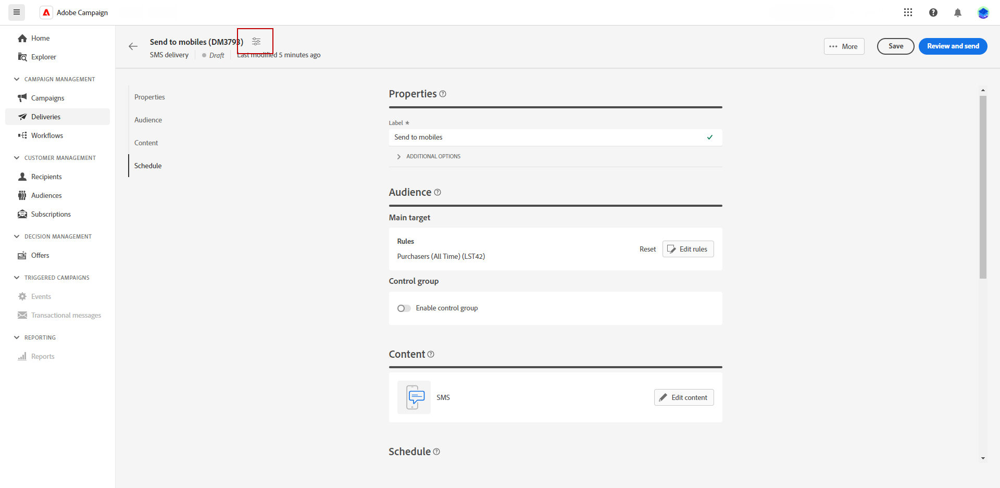

# 创建短信投放 {#create-sms}

>[!CONTEXTUALHELP]
>id="acw_deliveries_sms_properties"
>title="短信投放属性"
>abstract="这些属性包含帮助您为投放命名和分类的常见投放参数。如果您的投放基于扩展架构，则有特定的“自定义选项”字段可用。"

>[!CONTEXTUALHELP]
>id="acw_deliveries_sms_audience"
>title="定义短信受众"
>abstract="选择最适合您的短信消息的受众。"

>[!CONTEXTUALHELP]
>id="acw_deliveries_sms_template_selection"
>title="短信模板选择"
>abstract="选择预定义模板以开始您的短信投放。"

1. 从&#x200B;**[!UICONTROL 投放]**&#x200B;主页上单击&#x200B;**[!UICONTROL 创建投放]**。

1. 在&#x200B;**[!UICONTROL 渠道]**&#x200B;部分下，选择“短信”作为渠道并选择一个模板。[详细了解模板](../msg/delivery-template.md)

1. 单击&#x200B;**[!UICONTROL 创建投放]**&#x200B;按钮以进行确认。

   

1. 输入投放的&#x200B;**[!UICONTROL 标签]**&#x200B;并访问&#x200B;**[!UICONTROL 其他选项]**&#x200B;下拉列表。

   +++根据您的要求配置以下设置。
   * **[!UICONTROL 内部名称]**：为投放分配一个唯一标识符。
   * **[!UICONTROL 文件夹]**：将投放存储在特定文件夹中。
   * **[!UICONTROL 投放代码]**：使用您自己的命名惯例整理投放。
   * **[!UICONTROL 描述]**：提供投放的描述。
   * **[!UICONTROL 性质]**：指定电子邮件的性质以进行分类。
+++

1. 单击&#x200B;**[!UICONTROL 选择受众]**&#x200B;按钮以现有受众为目标或创建您自己的受众。[了解详情](../audience/about-audiences.md)。

   

1. 开启&#x200B;**[!UICONTROL 启用对照组]**&#x200B;选项以设置对照组以衡量投放的作用，并使您可比较收到消息的人群的行为与未收到消息的联系人的行为。[了解详情](../audience/control-group.md)

1. 单击&#x200B;**[!UICONTROL 编辑内容]**&#x200B;以开始设计短信消息的内容。

1. 要安排在特定的日期和时间投放，请开启&#x200B;**[!UICONTROL 启用计划]**&#x200B;选项。开始投放后，将在您为收件人定义的确切日期和时间自动发送消息。

1. 单击 **[!UICONTROL 配置投放设置]** 访问与投放模板相关的高级选项。 [了解详情](../advanced-settings/delivery-settings.md)

   
