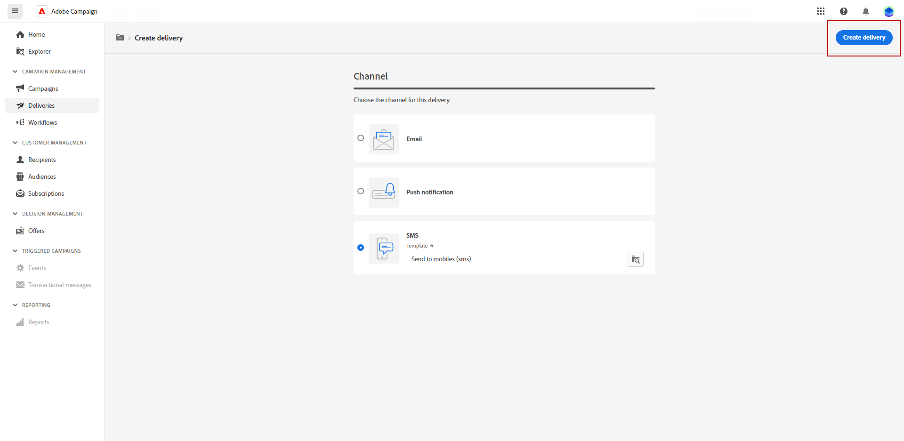

# 创建短信投放 {#create-sms}

>[!CONTEXTUALHELP]
>id="acw_deliveries_sms_properties"
>title="短信投放属性"
>abstract="这些属性包含帮助您为投放命名和分类的常见投放参数。如果您的投放基于扩展架构，则有特定的“自定义选项”字段可用。"

>[!CONTEXTUALHELP]
>id="acw_deliveries_sms_audience"
>title="定义短信受众"
>abstract="可创建新受众或通过单击&#x200B;**选择受众**&#x200B;按钮而选择现有受众。如果需要，可添加对照组以衡量投放的影响力。"
>additional-url="https://experienceleague.adobe.com/docs/campaign-web/v8/audiences/target-audiences/control-group.html?lang=zh-Hans" text="设置对照组"

>[!CONTEXTUALHELP]
>id="acw_deliveries_sms_template_selection"
>title="短信模板选择"
>abstract="选择预定义模板以开始投放您的短信。通过投放模板，可轻松地在营销活动和投放中重用自定义内容和设置。"
>additional-url="https://experienceleague.adobe.com/docs/campaign-web/v8/msg/delivery-template.html?lang=zh-Hans" text="使用投放模板"

您可以创建独立的短信投放，或在活动工作流的上下文中创建短信。 以下步骤详细介绍了独立（一次性）短信投放的过程。 如果您在活动工作流的上下文中工作，有关创建步骤的详细信息，请参阅 [本节](../workflows/activities/channels.md#create-a-delivery-in-a-campaign-workflow).

要创建新的独立短信投放，请执行以下步骤：

1. 浏览至 **[!UICONTROL 投放]** 菜单，然后单击  **[!UICONTROL 创建投放]** 按钮。

1. 在 **[!UICONTROL 渠道]** 部分，选择短信作为渠道，然后选择模板。 [了解有关模板的更多信息](../msg/delivery-template.md)

1. 单击&#x200B;**[!UICONTROL 创建投放]**&#x200B;按钮以进行确认。

   {zoomable="yes"}

1. 输入 **[!UICONTROL 标签]** ，并访问 **[!UICONTROL 其他选项]** 下拉菜单。 如果您的投放基于扩展模式，请指定 **自定义选项** 字段可用。

   +++根据您的要求配置以下设置。
   * **[!UICONTROL 内部名称]**：为投放分配一个唯一标识符。
   * **[!UICONTROL 文件夹]**：将投放存储在特定文件夹中。
   * **[!UICONTROL 投放代码]**：使用您自己的命名惯例整理投放。
   * **[!UICONTROL 描述]**：提供投放的描述。
   * **[!UICONTROL 自然]**：指定投放的性质以进行分类。
+++

1. 单击&#x200B;**[!UICONTROL 选择受众]**&#x200B;按钮以现有受众为目标或创建您自己的受众。[了解有关受众的更多信息](../audience/about-recipients.md).

   {zoomable="yes"}

   了解如何在中选择现有受众 [此页面](../audience/add-audience.md)

   了解如何在中创建新受众 [此页面](../audience/one-time-audience.md)

1. 打开 **[!UICONTROL 启用对照组]** 用于设置控制组以测量投放影响的选项。 消息不会发送到该控制组，因此您可以将收到消息的群体的行为与未收到消息的联系人的行为进行比较。 [了解更多信息](../audience/control-group.md)

1. 单击 **[!UICONTROL 编辑内容]** 开始设计短信消息的内容。 [了解更多信息](content-sms.md)

   {zoomable="yes"}

   在此屏幕中，您还可以 [模拟您的内容](../preview-test/preview-test.md) 和 [设置优惠](../msg/offers.md).

1. 要安排在特定的日期和时间投放，请开启&#x200B;**[!UICONTROL 启用计划]**&#x200B;选项。启动投放后，系统将在您为收件人定义的确切日期和时间自动发送消息。 在中了解有关投放计划的更多信息 [本节](../msg/gs-deliveries.md#gs-schedule).

   >[!NOTE]
   >
   >在工作流上下文中发送投放时，您必须使用 **计划程序** 活动。 请参阅[此页面](../workflows/activities/scheduler.md)以了解详情。

1. 单击 **[!UICONTROL 设置]** 访问与投放模板相关的高级选项。 [了解更多信息](../advanced-settings/delivery-settings.md)

   {zoomable="yes"}
