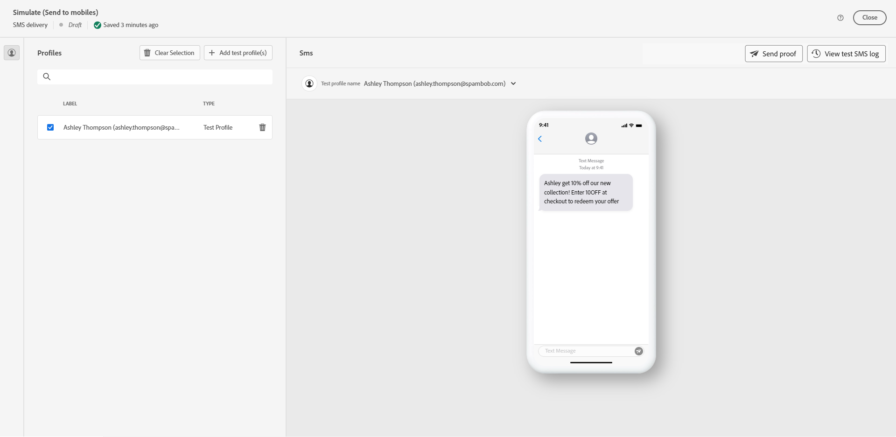
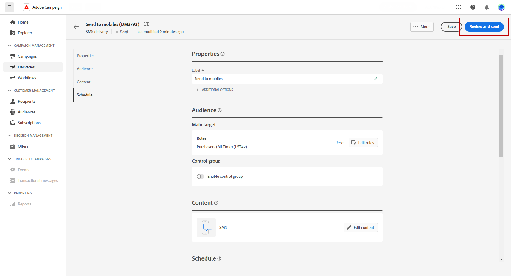

# 预览和发送短信投放 {#send-sms}

## 预览短信投放{#preview-sms}

定义消息内容后，您可以利用测试用户档案进行预览和测试。 如果您已包含个性化内容，则可以使用测试用户档案数据检查此内容在消息中的显示方式。 这样，您就可以确保消息按预期显示，并正确显示任何个性化信息。

1. 在投放内容页面中，您可以使用 **[!UICONTROL 模拟内容]** 以预览您的个性化内容。

   

1. 单击&#x200B;**[!UICONTROL 添加测试配置文件]**&#x200B;以选择一个或多个测试配置文件。

1. 选择测试配置文件后，单击&#x200B;**[!UICONTROL 选择]**。

   

1. 在右侧窗格中，您将看到电子邮件的预览，其中来自所选配置文件的数据取代个性化的元素。

   

现在可审查短信消息并将其发送到受众。

## 测试短信投放 {#test-send-sms}

替换为 **Adobe Campaign**，则能够在将消息发送到主要受众之前对其进行测试，这是验证电子邮件营销活动和识别潜在问题的关键步骤。

发送测试短信是确保投放质量和效果的重要步骤。 测试收件人可以检查各种元素，例如链接、选择退出链接和图像，并识别渲染、内容、个性化设置和短信配置中的任何错误。 此过程可帮助您在联系主要受众之前彻底评估和优化短信。

 请在此了解如何发送测试短信 [页面](../preview-test/proofs.md).

## 发送短信投放 {#preview-send-sms}

1. 个性化短信内容后，单击 **[!UICONTROL 查看并发送]** 来自您的 **[!UICONTROL 投放]** 页面。

   

1. 单击**[!UICONTROL 准备]**并监控提供的进度和统计数据。

   如果发生任何错误，请参阅日志菜单以了解有关失败的详细信息。

1. 通过单击 **[!UICONTROL 发送]** 以继续进行最终发送过程。

   

1. 通过单击 **[!UICONTROL 发送]** 按钮。

发送投放后，您可以从投放页面跟踪KPI（关键绩效指标）数据，并从“日志”菜单跟踪数据。

您现在可以使用内置报告开始衡量消息的影响。 [了解详情](../reporting/sms-report.md)

