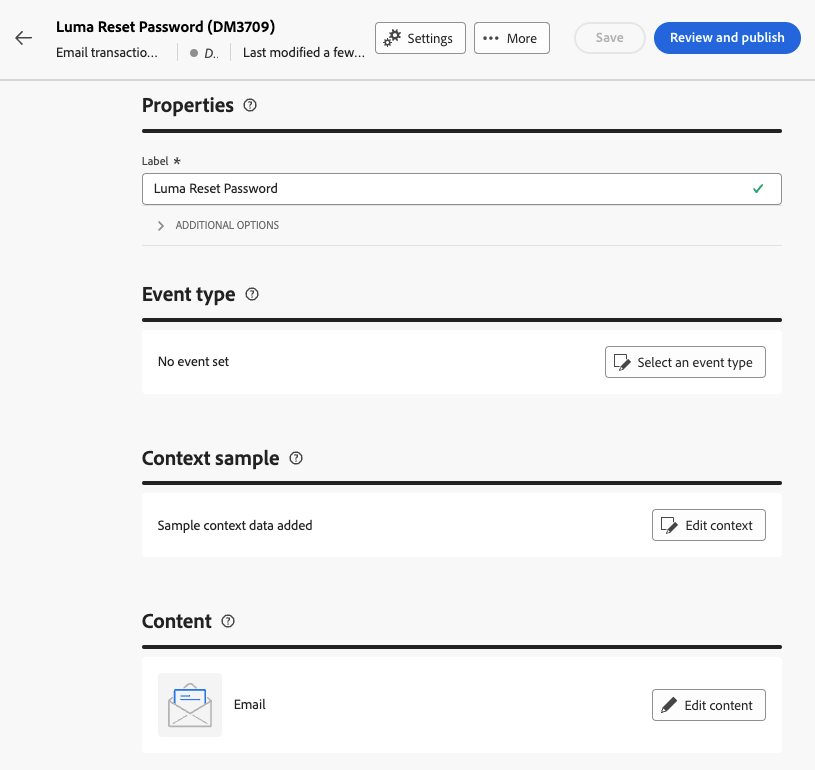

# 创建事务型消息

在事务型消息传递中，事件会触发个性化消息的发送。 要启用此功能，请为每个事件类型创建一个消息模板。 这些模板包含个性化事务型消息的所有必要信息。

## 创建事务型消息模板 {#transactional-template}

在Campaign Web用户界面中，事务性消息配置的第一步是创建模板或直接创建消息。 这与客户端控制台](https://experienceleague.adobe.com/en/docs/campaign/campaign-v8/send/real-time/transactional)上的[事务性消息的配置不同。

事务型消息模板可用于在到达最终受众之前预览用户档案收到的投放内容。 例如，管理员可以设置和配置模板，以便营销用户随时使用。

要创建事务型消息模板，请执行以下步骤：

* 在&#x200B;**[!UICONTROL 触发的消息]**&#x200B;部分中，转到&#x200B;**[!UICONTROL 事务型消息]**。 在&#x200B;**[!UICONTROL 模板]**&#x200B;选项卡中，您可以查看事务型消息的所有投放模板。 单击&#x200B;**[!UICONTROL 创建事务型消息模板]**&#x200B;按钮开始创建模板。

  {zoomable="yes"}

* 在显示的新页面中，选择模板的渠道。 对于此示例，请选择&#x200B;**[!UICONTROL 电子邮件]**&#x200B;渠道。 您也可以使用其他消息模板，并在模板列表中选择该模板。

  {zoomable="yes"}

  再次单击&#x200B;**[!UICONTROL 创建事务型消息]**&#x200B;按钮，验证在选定渠道上创建的模板。

* 访问事务型消息模板的配置。

  {zoomable="yes"}

### 交易型消息属性 {#transactional-properties}

>[!CONTEXTUALHELP]
>id="acw_transacmessages_properties"
>title="交易型消息传递属性"
>abstract="填写此表单以配置交易型消息传递属性。"

>[!CONTEXTUALHELP]
>id="acw_transacmessages_email_properties"
>title="交易型消息传递电子邮件属性"
>abstract="填写此表单以配置交易型消息传递电子邮件属性。"

>[!CONTEXTUALHELP]
>id="acw_transacmessages_sms_properties"
>title="交易型消息传递 SMS 属性"
>abstract="填写此表单以配置交易型消息传递 SMS 属性。"

>[!CONTEXTUALHELP]
>id="acw_transacmessages_push_properties"
>title="交易型消息传递推送属性"
>abstract="填写此表单以配置交易型消息传递推送属性。"

事务型消息的&#x200B;**[!UICONTROL 属性]**&#x200B;部分可帮助您设置：

* **[!UICONTROL 标签]**，事务型消息列表中显示的名称。 明确为研究和今后的使用作准备。
* **[!UICONTROL 内部名称]**，这是将您的消息与创建的其他消息区分开的唯一名称。
* 创建事务性消息模板的&#x200B;**[!UICONTROL 文件夹]**。
* **[!UICONTROL 执行文件夹]**，在执行后存储消息。
* **[!UICONTROL 传递代码]**，如果需要，该代码有助于识别消息以进行报告。
* **[!UICONTROL 描述]**。
* 在枚举&#x200B;*deliveryNature*&#x200B;中列出的&#x200B;**[!UICONTROL Nature]**，它是您的投放的性质。 [了解有关枚举的详细信息](https://experienceleague.adobe.com/en/docs/campaign/campaign-v8/config/configuration/ui-settings#enumerations)。

{zoomable="yes"}

### 移动设备应用程序 {#mobile-app}

>[!CONTEXTUALHELP]
>id="acw_transacmessages_mobileapp"
>title="交易型消息传递移动设备应用程序"
>abstract="在本节中，您可以选择想要用来推送消息的应用程序。"

在此部分中，选择要将消息推送到的应用程序。

通过单击搜索图标，访问Adobe Campaign实例中的移动设备应用程序列表。

{zoomable="yes"}

### 上下文示例 {#context-sample}

>[!CONTEXTUALHELP]
>id="acw_transacmessages_context"
>title="交易型消息传递上下文"
>abstract="通过上下文示例，您可以创建一个测试事件，以预览通过轮廓个性化收到的交易型消息。"

>[!CONTEXTUALHELP]
>id="acw_transacmessages_addcontext"
>title="交易型消息传递上下文"
>abstract="通过上下文示例，您可以创建一个测试事件，以预览通过轮廓个性化收到的交易型消息。"

通过上下文示例，您可以创建一个测试事件，以预览通过轮廓个性化收到的交易型消息。

此步骤是可选的。您可以使用没有上下文示例的模板，但缺点是无法预览个性化内容。

在设置密码的示例中，事件会发送用户的名字、姓氏以及个性化链接以重置其密码。 上下文可以配置，如下所示。

上下文的内容取决于您需要的个性化设置。

{zoomable="yes"}

### 交易型消息模板内容 {#transactional-content}

>[!CONTEXTUALHELP]
>id="acw_transacmessages_content"
>title="交易型消息传递内容"
>abstract="了解如何创建交易型消息传递内容。"

>[!CONTEXTUALHELP]
>id="acw_transacmessages_personalization"
>title="交易型消息传递个性化"
>abstract="了解如何个性化交易型消息传递内容。"

>[!CONTEXTUALHELP]
>id="acw_personalization_editor_event_context"
>title="事件上下文"
>abstract="此菜单提供触发事件的变量，您可以利用这些变量来个性化您的交易型消息内容。"

处理事务型消息的内容与创建投放的内容类似。 单击&#x200B;**[!UICONTROL 打开电子邮件设计器]**&#x200B;或&#x200B;**[!UICONTROL 编辑电子邮件正文]**，然后选择模板内容或导入HTML代码。

{zoomable="yes"}

要将个性化内容添加到内容中，请单击要添加该内容的部分，然后选择&#x200B;**[!UICONTROL 添加Personalization]**&#x200B;图标。

{zoomable="yes"}

访问&#x200B;**[!UICONTROL 编辑个性化]**&#x200B;窗口。 若要从触发器事件添加变量，请单击&#x200B;**[!UICONTROL 事件上下文]**&#x200B;图标。 导航您为模板定义的上下文（[了解有关该上下文的更多信息](#context-sample)），然后单击&#x200B;**[!UICONTROL +]**&#x200B;按钮以插入所需的变量。

下图显示了如何为名字添加个性化设置。

{zoomable="yes"}

在此示例中，添加名字、姓氏并个性化&#x200B;**[!UICONTROL 重置密码]**&#x200B;按钮链接。

{zoomable="yes"}

### 预览模板

在模板创建的这个阶段，预览模板内容并检查个性化。

为此，请填写[上下文示例](#context-sample)，然后单击&#x200B;**[!UICONTROL 模拟内容]**&#x200B;按钮。

{zoomable="yes"}

## 创建事务性消息 {#transactional-message}

您可以直接创建事务型消息，也可以使用事务型消息模板创建事务型消息。 [了解如何创建事务型消息模板](#transactional-template)。

要创建事务型消息，请执行以下步骤：

* 在&#x200B;**[!UICONTROL 触发的消息]**&#x200B;部分中，转到&#x200B;**[!UICONTROL 事务型消息]**。 在&#x200B;**[!UICONTROL 浏览]**&#x200B;选项卡中，您可以看到创建的所有事务型消息。 单击&#x200B;**[!UICONTROL 创建事务型消息]**&#x200B;按钮开始创建消息。

  {zoomable="yes"}

* 在显示的新页面中，选择消息的渠道，然后选择要使用的模板。 在此示例中，选择[之前创建的模板](#transactional-template)。

  {zoomable="yes"}

  再次单击&#x200B;**[!UICONTROL 创建事务型消息]**&#x200B;按钮，验证在选定渠道上创建的消息。

* 访问事务型消息的配置。 您的消息将继承模板的配置。 此页面与事务型消息模板配置页面几乎完全相同，不同之处仅在于此页面还包括事件类型配置。

  {zoomable="yes"}

  将消息的配置作为模板进行填写：
   * [交易型消息属性](#transactional-properties)
   * [上下文示例](#context-sample)
   * [消息内容](#transactional-content)
和[配置事件类型](#event-type)，如下所述。

* 在[验证事务型消息](validate-transactional.md)后，单击&#x200B;**[!UICONTROL 查看和发布]**&#x200B;按钮创建和发布消息。 触发器现在可以推送事务型消息的发送。

### 关于事件类型 {#event-type}

>[!CONTEXTUALHELP]
>id="acw_transacmessages_event"
>title="交易型消息传递事件"
>abstract="事件类型的配置将消息与触发事件联系起来。"

事件类型的配置将消息与触发事件联系起来。

在Campaign Web用户界面中，选择已创建的事件类型，或直接在此配置页面中创建事件类型。

{zoomable="yes"}

>[!CAUTION]
>
>如果选择另一个事务型消息当前正在使用的事件类型，则会触发这两个消息。 为获取最佳实践，**将一个事件类型链接到仅一个事务型消息。**

## 将选件添加到事务型消息 {#transactional-offers}

您可以在事务型消息中包含选件，以便向最终用户提交相关建议，即使消息是事件触发的。

在事务型消息的内容编辑阶段可访问此功能。 单击&#x200B;**[!UICONTROL 设置选件]**&#x200B;按钮进行配置。

设置过程与为标准投放配置选件相同。 [了解如何将优惠添加到您的消息](../msg/offers.md)。

{zoomable="yes"}