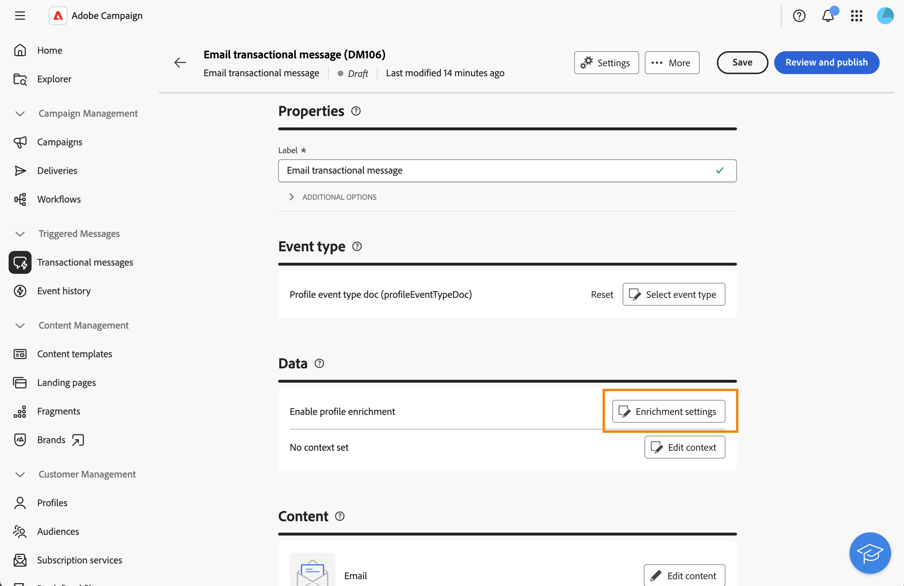

# 使用轮廓数据扩充事务性消息{#profile-enrichment}

>[!AVAILABILITY]
>
>此功能仅适用于一组组织（限量发布），并将在未来版本中在全球范围内推出。 您的服务器必须升级到8.8.2或更高版本。
>
>此功能目前仅适用于电子邮件。

此功能允许您通过将Adobe Campaign数据库字段链接到消息内容来个性化事务型消息。 您可以选择目标映射、扩充列和协调键，以确保准确、实时的个性化，同时保持性能阈值。

* 基于事件的事务型消息使用事件本身包含的数据。
* 基于用户档案的事务型消息使用Adobe Campaign数据库中包含的数据。

要设置用户档案扩充，请执行以下步骤：

1. 创建事务型消息，[阅读更多](#create-enrichment)
1. 定义事件类型，[阅读更多](#event-enrichment)
1. 设置扩充设置，[了解更多](#settings-enrichment)
1. 定义内容，[阅读更多](#content-enrichment)
1. 验证并发送，[阅读更多](#send-enrichment)

## 创建事务型消息{#create-enrichment}

首先，您需要创建新的事务型消息。

1. 在&#x200B;**[!UICONTROL 触发的消息]**&#x200B;部分中，转到&#x200B;**[!UICONTROL 事务型消息]**&#x200B;并创建新事务型消息。

   {zoomable="yes"}

1. 选择模板并定义属性。 有关详细信息，请参见此 [&#x200B; 页面](create-transactional.md#transactional-message)。

## 定义事件类型{#event-enrichment}

然后，您需要将事件定义为基于用户档案的事件，以定向Adobe Campaign数据库中包含的数据。

1. 在&#x200B;**事件类型**&#x200B;部分中，选择&#x200B;**选择事件类型**，然后选择是要使用现有事件类型还是创建自己的事件类型。

   >[!NOTE]
   >
   >您不能选择已在另一个事务型消息模板中使用的事件类型。

   {zoomable="yes"}

1. 输入事件类型信息：

   * 对于现有事件类型，请从列表中选择它。
   * 对于新标签，请添加标签和名称。

1. 然后在&#x200B;**事件类型**&#x200B;下拉列表中选择&#x200B;**配置文件RT**。

   {zoomable="yes"}

## 设置扩充设置{#settings-enrichment}

现在，让我们向事件添加字段，以便您个性化事务型消息。

1. 在&#x200B;**数据**&#x200B;部分中，单击&#x200B;**扩充设置**。

   {zoomable="yes"}

   >[!NOTE]
   >
   >此按钮仅在定义基于用户档案的事件时可用。

1. 在&#x200B;**其他属性**&#x200B;部分中，单击&#x200B;**添加属性**&#x200B;并选择所需的字段。

   {zoomable="yes"}

1. 定义将用作协调键值的属性。

1. 选择当密钥在有效负荷中不可用时应发生的情况。

   * 发送的消息没有个性化
   * 消息未发送

## 定义内容{#content-enrichment}

然后，您需要定义事务型消息的内容。

1. 在&#x200B;**内容**&#x200B;部分中，单击&#x200B;**编辑内容**&#x200B;按钮并定义消息内容。 请参见[此页面](create-transactional.md#transactional-content)。

   {zoomable="yes"}

1. 使用个性化时，例如，在主题行上，使用&#x200B;**用户档案扩充**&#x200B;菜单添加之前定义的基于用户档案的字段。

   {zoomable="yes"}

## 验证并发送{#send-enrichment}

最后，您需要验证并发送投放。

1. 通过模拟内容和发送校样来验证投放。 请参见[此页面](validate-transactional.md)。

1. 单击&#x200B;**[!UICONTROL 查看和发布]**&#x200B;按钮创建和发布消息。 触发器现在可以启动事务型消息的发送。

<!--
When creating the event configuration, select the Profile event targeting dimension (see Creating an event).

Add fields to the event, in order to be able to personalize the transactional message (see Defining the event attributes). You must add at least one field to create an enrichment. You do not need to create other fields such as First name and Last name as you will be able to use personalization fields from the Adobe Campaign database.

Create an enrichment in order to link the event to the Profile resource (see Enriching the event) and select this enrichment as the Targeting enrichment.

IMPORTANT
This step is mandatory for profile-based events.
Preview and publish the event (see Previewing and publishing the event).

When previewing the event, the REST API does not contain an attribute specifying the email address, mobile phone, or push notification specific attributes, as it will be retrieved from the Profile resource.

Once the event has been published, a transactional message linked to the new event is automatically created. In order for the event to trigger sending a transactional message, you must modify and publish the message that was just created…

Integrate the event into your website (see Integrate the event triggering).
-->

