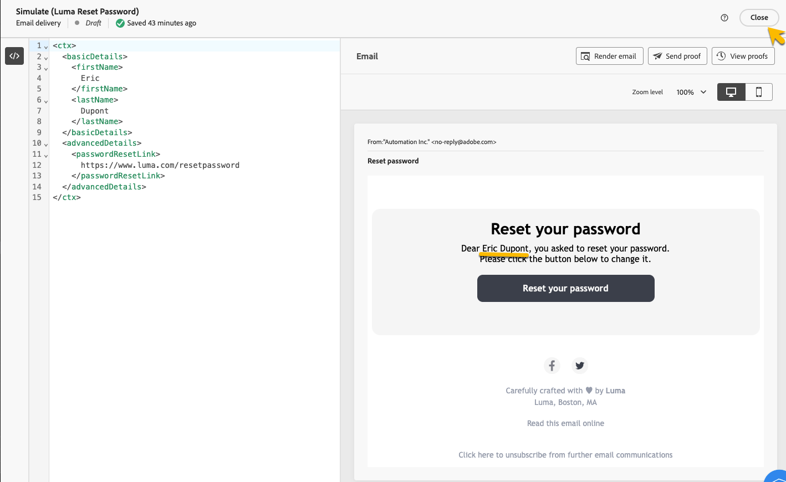

# 验证事务型消息

在创建事务型消息期间或之后，您可能需要使用数据示例验证内容。

## 模拟内容 {#simulate-content}

按照以下步骤模拟消息的内容：

* 确保消息内容中的个性化路径与上下文示例匹配。 在以下示例中，要显示测试配置文件的名字，请使用路径&#x200B;*rtEvent.ctx.basicDetails.firstName*。

  您可以修改消息内容或上下文示例以使它们保持一致。

  {zoomable="yes"}

* 单击&#x200B;**[!UICONTROL 模拟内容]**&#x200B;按钮，使用在上下文示例中输入的数据预览事务型消息。

  {zoomable="yes"}

  查看内容后，单击&#x200B;**[!UICONTROL 关闭]**&#x200B;按钮。

* 如果您对内容进行了任何更改，请确保单击&#x200B;**[!UICONTROL 重新发布]**&#x200B;按钮。

## 发送校样

要测试和体验通过所选渠道（如电子邮件、短信或推送通知）投放的事务型消息，请使用验证功能。

在[模拟内容窗口](#simulate-content)中，单击&#x200B;**[!UICONTROL 发送校样]**&#x200B;按钮。

{zoomable="yes"}

在出现的新窗口中，输入电子邮件地址或电话号码，具体取决于您希望接收校样的渠道。 输入所需地址后，单击&#x200B;**[!UICONTROL 发送校样]**&#x200B;和&#x200B;**[!UICONTROL 确认]**&#x200B;按钮。 此操作发送事务型消息的示例，确保所有个性化、动态内容和格式正确显示，就像最终用户显示的一样。

{zoomable="yes"}

此步骤对于在发布事务型消息之前识别任何潜在问题至关重要。