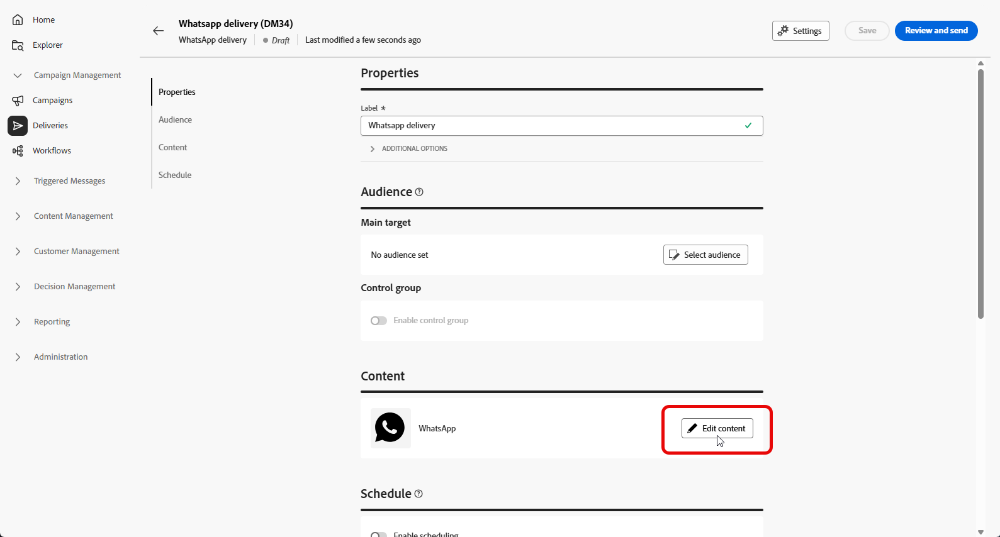

# 创建WhatsApp消息 {#create-whatsapp}

**Adobe Campaign Web用户界面**&#x200B;允许您设计使用Meta批准的模板的WhatsApp消息，为每个用户档案对其进行个性化设置，并在发送之前对其进行测试。

+++ 了解有关支持的消息元素和行动号召的更多信息

WhatsApp支持以下消息类型：

| 消息功能 | 说明 |
|-|-|
| 标头 | 显示在消息正文上方的可选文本。 |
| 文本 | 通过参数支持动态内容。 |
| 页眉图像 | 显示在消息正文上方的可选图像。 |
| 正文文本 | 通过参数支持动态内容。 |
| 页脚文本 | 通过参数支持动态内容。 |

+++

## 创建WhatsApp投放 {#create-whatsapp-journey-campaign}

>[!IMPORTANT]
>
>当前不支持WhatsApp消息反馈。

在Adobe Campaign Web用户界面中，按照以下步骤创建独立的WhatsApp投放。

1. 浏览到&#x200B;**[!UICONTROL 投放]**&#x200B;菜单，然后单击&#x200B;**[!UICONTROL 创建投放]**。

   

1. 选择&#x200B;**[!UICONTROL WhatsApp]**&#x200B;并选择投放模板。 [了解有关模板的更多信息](../msg/delivery-template.md)。

   

1. 单击&#x200B;**[!UICONTROL 创建投放]**&#x200B;以确认。

1. 单击&#x200B;**[!UICONTROL 设置]**&#x200B;可获取与模板关联的高级选项。 [了解详情](../advanced-settings/delivery-settings.md)

   

1. 输入投放的&#x200B;**[!UICONTROL 标签]**。 如果您需要与其他渠道相同的内部名称、文件夹、投放代码、描述或性质，请使用&#x200B;**[!UICONTROL 其他选项]**。

1. 单击&#x200B;**[!UICONTROL 选择受众]**&#x200B;以定位现有受众或构建一个受众。 [了解有关受众的详细信息](../audience/about-recipients.md)。

1. 单击&#x200B;**[!UICONTROL 编辑内容]**&#x200B;以打开WhatsApp内容编辑器，请参阅[定义WhatsApp内容](#whatsapp-content)。

   

1. 您可以启用&#x200B;**[!UICONTROL 启用计划]**&#x200B;以在特定的日期和时间发送。 [了解详情](../msg/gs-deliveries.md#gs-schedule)。

## 定义WhatsApp内容{#whatsapp-content}

>[!BEGINSHADEBOX]

在Adobe Campaign Web用户界面中设计WhatsApp消息之前，请在Meta中创建并提交模板。 [了解详情](https://www.facebook.com/business/help/2055875911147364?id=2129163877102343)

您的WhatsApp模板在使用之前必须获得Meta的批准。 批准通常需要几个小时，但最长可能需要24小时。 [了解详情](https://developers.facebook.com/docs/whatsapp/message-templates/guidelines/#approval-process)

>[!ENDSHADEBOX]

1. 在Adobe Campaign Web用户界面的“投放配置”页面中，单击&#x200B;**[!UICONTROL 编辑内容]**&#x200B;以配置WhatsApp消息。

1. 选择营销作为&#x200B;**模板类别**：

   [了解有关模板类别的更多信息](https://developers.facebook.com/docs/whatsapp/updates-to-pricing/new-template-guidelines/#template-category-guidelines)

   

1. 从&#x200B;**WhatsApp模板**&#x200B;下拉列表中，选择您的Meta批准的模板。

   [了解有关如何创建WhatsApp模板的更多信息](https://www.facebook.com/business/help/2055875911147364?id=2129163877102343)

   

1. 如果您的Meta批准的模板包含图像，请提供&#x200B;**[!UICONTROL 图像URL]**。

   

1. 在&#x200B;**Personalization占位符**&#x200B;字段中，使用个性化编辑器将配置文件字段和表达式映射到模板参数。 [了解详情](../personalization/personalize.md)。

   

消息就绪时：

* **独立或营销活动投放**：在投放仪表板上使用&#x200B;**[!UICONTROL 审阅和发送]**&#x200B;和&#x200B;**[!UICONTROL 发送]**。

* **工作流**：在执行使其可用时从工作流活动打开投放，然后以相同方式使用投放仪表板。 [了解详情](../workflows/start-monitor-workflows.md)

然后，您可以跟踪投放&#x200B;**[!UICONTROL 报告]**&#x200B;入口点和[投放报告](../reporting/delivery-reports.md)的结果。
