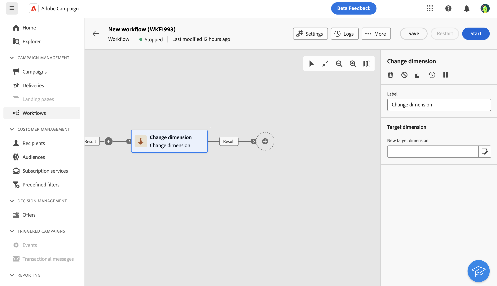

# 更改维度 {#change-dimension}

>[!CONTEXTUALHELP]
>id="acw_orchestration_dimension_complement"
>title="生成补码"
>abstract="您可以使用已作为重复项排除的剩余群体生成额外的叫客过渡。 为此，请打开 **生成补码** option"

>[!CONTEXTUALHELP]
>id="acw_orchestration_change_dimension"
>title="更改维度活动"
>abstract="利用此活动，可在构建受众时更改定向维度。 它根据数据模板和输入维度移动轴。 例如，您可以从“合同”维度切换到“客户”维度。"

此 **更改维度** 活动是 **定位** 活动。 利用此活动，可在构建受众时更改定向维度。 此活动根据数据模板和输入维度移动轴。 例如，您可以从“合同”维度切换到“客户”维度。

您还可以使用此活动定义新目标的附加列，并定义重复数据删除标准。

## 配置

按照以下步骤配置 **更改维度** 活动：

1. 添加 **更改维度** 活动添加到工作流。

   

1. 定义 **新建目标维度**.

在维度更改期间，将保留所有记录。