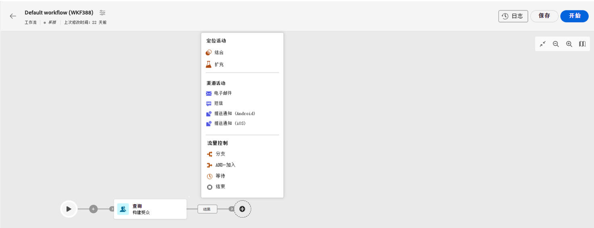
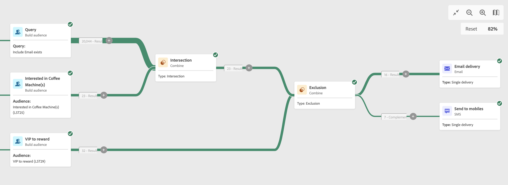

# 电子邮件、短信、推送活动 {#channel}

>[!CONTEXTUALHELP]
>id="acw_orchestration_email"
>title="电子邮件活动"
>abstract="跨电子邮件、短信和推送渠道自动执行营销活动。 您可以将渠道活动组合到工作流画布中，以创建可根据客户行为和数据触发操作的跨渠道工作流。 "

>[!CONTEXTUALHELP]
>id="acw_orchestration_sms"
>title="电子邮件活动"
>abstract="跨电子邮件、短信和推送渠道自动执行营销活动。 您可以将渠道活动组合到工作流画布中，以创建可根据客户行为和数据触发操作的跨渠道工作流。 "

>[!CONTEXTUALHELP]
>id="acw_orchestration_push_ios"
>title="电子邮件活动"
>abstract="跨电子邮件、短信和推送渠道自动执行营销活动。 您可以将渠道活动组合到工作流画布中，以创建可根据客户行为和数据触发操作的跨渠道工作流。 "

>[!CONTEXTUALHELP]
>id="acw_orchestration_push_android"
>title="电子邮件活动"
>abstract="跨电子邮件、短信和推送渠道自动执行营销活动。 您可以将渠道活动组合到工作流画布中，以创建可根据客户行为和数据触发操作的跨渠道工作流。 "

Adobe Campaign Web 允许您跨电子邮件、短信或推送渠道自动化和执行营销活动。您可以将渠道活动组合到工作流画布中，以创建可根据客户行为和数据触发操作的跨渠道工作流。

例如，您可以创建一个欢迎电子邮件活动，其中包含跨不同渠道（例如电子邮件、短信或推送消息）的一系列消息。您还可以在客户完成购买后发送跟进电子邮件，或者通过短信向客户发送个性化的生日消息。

通过使用渠道活动，您可以创建全面、个性化的营销活动，通过多个接触点吸引客户并推动转化。

>[!NOTE]
>
>您还可以创建一次性投放，而不限于营销活动工作流的上下文。 请参阅以下部分以了解详情：
>* [创建独立的电子邮件投放](../../email/create-email.md)
>* [创建独立的短信投放](../../sms/create-sms.md)
>* [创建独立推送投放](../../push/create-push.md)

## 构建工作流{#build-your-workflow}

在放置投放之前，开始使用相关活动构建工作流：

* 如果要发送重新定向投放，请使用启动工作流 **计划程序** 活动。 如果要发送一次性投放，您可以使用定义联系日期 **计划程序** 活动或在投放设置中定义计划。 请参阅[此章节](scheduler.md)。

* 添加一个&#x200B;**生成受众**&#x200B;活动。受众是投放的主要目标：接收邮件的收件人。在营销活动工作流的上下文中发送消息时，消息受众不是在渠道活动中定义的，而是在&#x200B;**生成受众**&#x200B;活动中定义的。请参阅[此章节](build-audience.md)。

  

## 设置投放 {#create-a-delivery-in-a-workflow}

要在工作流上下文中设置投放，请执行以下步骤：

1. 添加渠道活动： **[!UICONTROL 电子邮件]**， **[!UICONTROL 短信]**， **[!UICONTROL 推送通知(Android)]** 或 **[!UICONTROL 推送通知(iOS)]**.

1. 选择 **投放类型**：单次或循环。

   * **单次投放**：这是一次性投放，只发送一次，例如黑色星期五电子邮件。
   * **循环投放**：对于此类投放，您可以使用设置执行频率 [调度程序活动](scheduler.md). 每次运行工作流时，都会重新计算受众，并且会随更新的内容发送投放。 这可以是每周新闻稿或定期生日电子邮件。

1. 选择投放&#x200B;**模板**。模板是专用于渠道的预配置的投放设置。每个渠道都有一个内置模板，并且默认情况下已预先填充。[了解详情](../../msg/delivery-template.md)

   

   您可以从渠道活动配置左侧窗格中选择另一个模板。如果之前选择的受众与渠道不兼容，则您无法选择模板。要解决此问题，请更新&#x200B;**生成受众**&#x200B;活动，以选择具有正确目标映射的受众。要了解有关目标映射的更多信息，请参阅 [Adobe Campaign v8（客户端控制台）文档](https://experienceleague.adobe.com/docs/campaign/campaign-v8/audience/add-profiles/target-mappings.html){target="_blank"}.

1. 单击&#x200B;**创建投放**。定义消息设置和内容的方式与创建独立投放的方式相同。您还可以安排和模拟内容。[了解详情](../../msg/gs-messages.md)。

1. 导航回工作流。 选择是否要继续工作流 **生成叫客过渡** 如果要在渠道活动后添加过渡。

1. 单击&#x200B;**开始**&#x200B;启动您的工作流。

   默认情况下，启动工作流会触发消息准备阶段，而不立即发送消息。

1. 打开您的投放活动以确认从&#x200B;**查看并发送**&#x200B;按钮发送。

1. 在投放仪表板中，单击&#x200B;**发送**。

## 示例 {#cross-channel-workflow-sample}

这是一个跨渠道工作流示例，具有一个分段和两次投放。该工作流针对所有居住在巴黎且对咖啡机感兴趣的客户。在这些人群中，会向普通客户发送一封电子邮件，而向 VIP 客户发送一条短信。

<!--
description, which use case you can perform (common other activities that you can link before of after the activity)

how to add and configure the activity

example of a configured activity within a workflow
The Email delivery activity allows you to configure the sending an email in a workflow. 

-->

您还可以创建循环工作流，以根据订阅者的时区，在每月第一天晚上8点向其发送个性化推送通知。

<!-- Scheduled emails available?

This can be a single send email and sent just once, or it can be a recurring email.
* Single send emails are standard emails, sent once.
* Recurring emails allow you to send the same email multiple times to different targets over a defined period. You can aggregate the deliveries per period in order to get reports that correspond to your needs.

When linked to a scheduler, you can define recurring emails.
Email recipients are defined upstream of the activity in the same workflow, via an Audience targeting activity.

-->

<!--The message preparation is triggered according to the workflow execution parameters. From the message dashboard, you can select whether to request or not a manual confirmation to send the message (required by default). You can start the workflow manually or place a scheduler activity in the workflow to automate execution.-->
