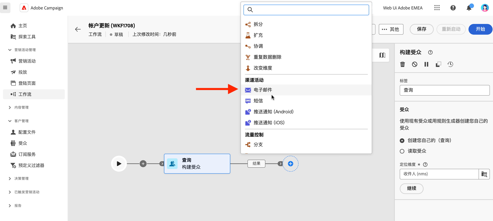

# 电子邮件、短信、推送 {#channel}

通过Adobe Campaign Web，您可以跨电子邮件、短信和推送渠道自动执行营销活动。 您可以将渠道活动合并到工作流画布中，以创建可根据客户行为和数据触发操作的跨渠道工作流。

例如，您可以创建一个欢迎电子邮件活动，其中包含跨不同渠道（例如电子邮件、短信或推送消息）的一系列消息。您还可以在客户完成购买后发送跟进电子邮件，或通过短信向客户发送个性化的生日消息。

通过使用渠道活动，您可以创建全面的个性化营销活动，在多个接触点吸引客户并促进转化。

以下是添加 **渠道** 工作流中的活动：

1. 确保您已添加 **构建受众** 活动。 受众是投放的主要目标：接收消息的收件人。 在营销活动工作流的上下文中发送消息时，未在渠道活动中定义消息受众，但在渠道活动中 **构建受众** 活动。 请参阅[此小节](build-audience.md)。

   

1. 选择投放活动：**[!UICONTROL 电子邮件]**、**[!UICONTROL 短信]**、**[!UICONTROL 推送通知 (Android)]** 或&#x200B;**[!UICONTROL 推送通知 (iOS)]**。

1. 选择投放 **模板**. 模板是特定于渠道的预配置投放设置。 每个渠道都有一个内置模板，默认情况下会预填充。 [了解详情](../../msg/delivery-template.md)

   

   您可以从渠道活动配置左窗格中选择其他模板。 如果之前选择的受众与渠道不兼容，则您无法选择模板。 要解决此问题，请更新 **构建受众** 活动以选择具有正确目标映射的受众。 在中了解有关目标映射的更多信息 [Adobe Campaign v8 （控制台）文档](https://experienceleague.adobe.com/docs/campaign/campaign-v8/audience/add-profiles/target-mappings.html){target="_blank"}.

1. 单击 **创建投放**. 按照创建独立投放的方式定义消息设置和内容。 您还可以计划和模拟内容。 [了解详情](../../msg/gs-messages.md)。

1. 导航回工作流，并保存更改。

1. 单击 **开始** 以启动工作流。

   默认情况下，启动工作流会触发消息准备阶段，而不会立即发送消息。

1. 打开您的投放活动，以确认发送自 **查看并发送** 按钮。

1. 在投放仪表板中，单击 **发送**.

## 示例

这是一个具有分段和两次投放的跨渠道工作流示例。 该工作流面向居住在巴黎并对咖啡机感兴趣的所有客户。 在此群体中，向常规客户发送电子邮件，向VIP客户发送短信。

<!--
description, which use case you can perform (common other activities that you can link before of after the activity)

how to add and configure the activity

example of a configured activity within a workflow
The Email delivery activity allows you to configure the sending an email in a workflow. 

-->

<!-- Scheduled emails available?

This can be a single send email and sent just once, or it can be a recurring email.
* Single send emails are standard emails, sent once.
* Recurring emails allow you to send the same email multiple times to different targets over a defined period. You can aggregate the deliveries per period in order to get reports that correspond to your needs.

When linked to a scheduler, you can define recurring emails.
Email recipients are defined upstream of the activity in the same workflow, via an Audience targeting activity.

-->

<!--The message preparation is triggered according to the workflow execution parameters. From the message dashboard, you can select whether to request or not a manual confirmation to send the message (required by default). You can start the workflow manually or place a scheduler activity in the workflow to automate execution.-->
