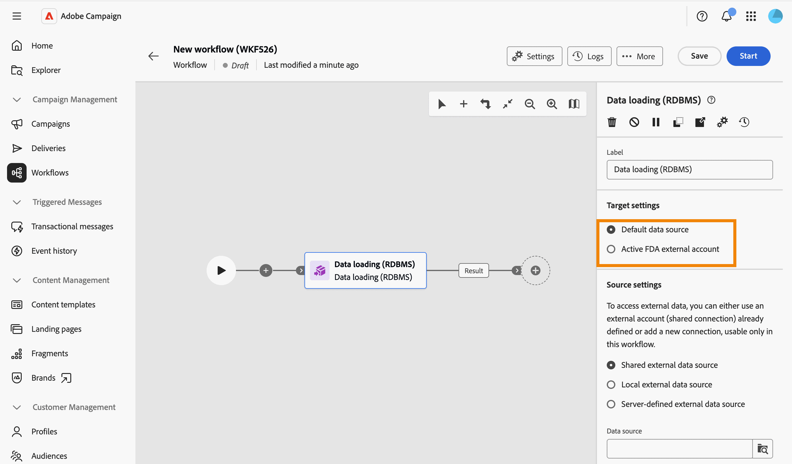
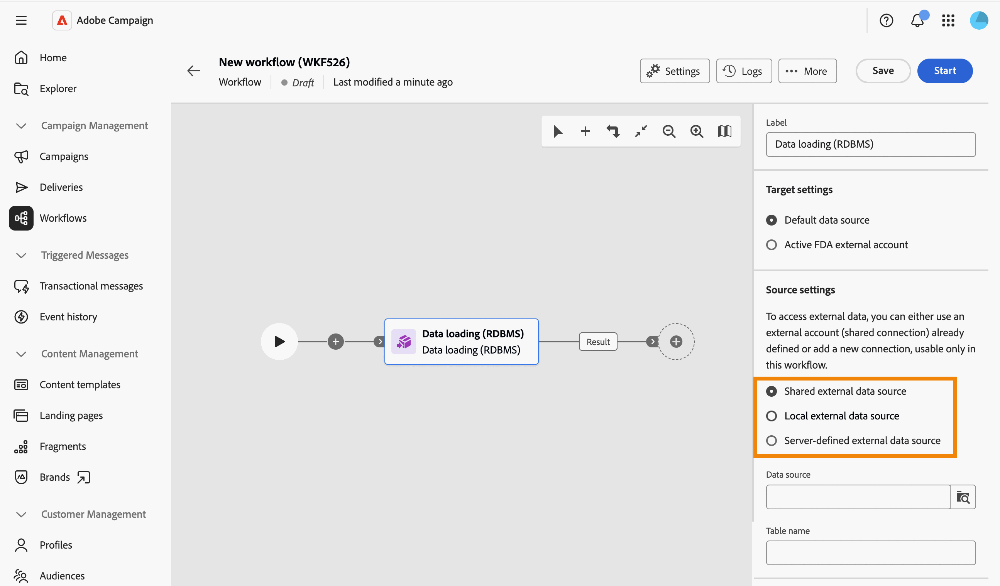

# 数据加载 (RDBMS) {#data-loading-rdbms}

>[!CONTEXTUALHELP]
>id="acw_orchestration_data_loading_rdbms"
>title="数据加载 (RDBMS) 活动"
>abstract="**数据加载 (RDBMS)**&#x200B;活动属于&#x200B;**数据管理**&#x200B;活动。 使用此活动将数据直接从外部关系数据库加载到工作流中。 提取的数据将在整个工作流中可用，可用于目标定位、数据扩充或进一步的数据处理。"

**数据加载 (RDBMS)**&#x200B;活动属于&#x200B;**数据管理**&#x200B;活动。 使用此活动将数据直接从外部关系数据库加载到工作流中。 提取的数据将在整个工作流中可用，可用于目标定位、数据扩充或进一步的数据处理。

<!--
This activity relies on the [Federated Data Access (FDA)](https://experienceleague.adobe.com/docs/campaign/campaign-v8/connect/fda.html){target="_blank"} option, which lets Adobe Campaign process information stored in one or more external databases without changing the structure of the Adobe Campaign data.
-->

>[!NOTE]
>
>为了提高性能，当要从外部数据库收集的数据量允许时，请考虑改用&#x200B;**[!UICONTROL 构建受众]**&#x200B;活动（查询类型）与外部数据。
>
>**[!UICONTROL 数据加载(RDBMS)]**&#x200B;活动必须是工作流分支的第一个活动。 不能将其添加到画布中的另一个活动之后。

首先，添加&#x200B;**数据加载(RDBMS)**&#x200B;活动作为工作流分支的第一个活动。

该活动分为四个部分：

* **[!UICONTROL 目标设置]**：选择加载数据的存储位置。 [了解详情](#target-settings)
* **[!UICONTROL Source设置]**：选择如何访问包含要加载的数据的外部数据库。 [了解详情](#source-settings)
* **[!UICONTROL 收集的信息]**：定义从外部表中收集的列。 [了解详情](#information-collected)
* **[!UICONTROL Source筛选]**：定义一个筛选器以仅从外部表中收集部分数据。 [了解详情](#filter)

请注意，只有定义了&#x200B;**[!UICONTROL Source设置]**&#x200B;后，才会显示最后两个部分。

## 目标设置 {#target-settings}

在&#x200B;**[!UICONTROL Target设置]**&#x200B;部分中，选择存储加载数据的位置。 有两个选项可用： **[!UICONTROL 默认数据源]**&#x200B;和&#x200B;**[!UICONTROL 活动FDA外部帐户]**。

### 默认数据源 {#default-data-source}

默认情况下，该选项处于选中状态。 利用该活动，您可以将加载的数据存储在默认的Campaign数据库中。 您只需选择选项。

### 活跃的 FDA 外部帐户 {#active-fda-external-account}

利用此选项，可将加载的数据存储在外部帐户中。

1. 单击&#x200B;**[!UICONTROL 数据源]**&#x200B;字段右侧的按钮。
1. 选择要使用的帐户。

   

## 源设置 {#source-settings}

在&#x200B;**[!UICONTROL Source设置]**&#x200B;部分中，选择如何访问包含要加载的数据的外部数据库。 有三个选项可用： **[!UICONTROL 共享外部数据源]**、**[!UICONTROL 本地外部数据源]**&#x200B;和&#x200B;**[!UICONTROL 服务器定义的外部数据源]**。

### 共享外部数据源 {#shared-data-source}

默认情况下，该选项处于选中状态。 它允许您使用已由Campaign管理员配置的外部帐户。 [了解如何配置外部帐户](../../administration/create-external-account.md)。

1. 单击&#x200B;**[!UICONTROL 数据源]**&#x200B;字段右侧的按钮，然后选择要使用的帐户。

   

1. 单击&#x200B;**[!UICONTROL 表名称]**&#x200B;字段旁边的&#x200B;**[!UICONTROL 浏览]**&#x200B;按钮，然后选择包含要加载的数据的表。

   

### 本地外部数据源 {#local-external-data-source}

此选项允许您在活动中直接定义与外部数据库的连接，仅供在此工作流中临时使用。 此连接未另存为外部帐户。

1. 单击&#x200B;**[!UICONTROL 定义数据源]**&#x200B;按钮并选择要连接的数据库引擎。

   

1. 填写为所选引擎显示的连接字段。

   

<!--
1. Click **[!UICONTROL Ok]** to confirm. The button is then relabeled **[!UICONTROL Edit data source]**, allowing you to open the dialog again to change the connection settings.
-->

1. 在&#x200B;**[!UICONTROL 表名称]**&#x200B;字段中输入要加载的表的名称。

### 服务器定义的外部数据源 {#server-defined-external-data-source}

此选项允许您使用已在服务器级别定义的数据库连接。

1. 在&#x200B;**[!UICONTROL 连接名称]**&#x200B;字段中输入要使用的连接名称。
1. 在&#x200B;**[!UICONTROL 表名称]**&#x200B;字段中输入要加载的表的名称。

   

## 收集的信息 {#information-collected}

设置表后，**[!UICONTROL 收集的信息]**&#x200B;部分允许您定义从外部表中收集哪些列：

1. 如果需要收集所选表的每个列，请选中&#x200B;**[!UICONTROL 保留所有源数据]**&#x200B;选项（默认）。
1. 单击&#x200B;**[!UICONTROL 添加列以提取]**&#x200B;以收集特定列，或者添加其他列。

   

<!--
In the **[!UICONTROL Select attribute]** dialog, scoped to the schema of the selected table, pick an attribute and confirm. [Learn how to select attributes and add them to favorites](../../get-started/attributes.md)
-->

1. 选择属性并进行确认。 该属性被添加为具有&#x200B;**[!UICONTROL Column]**&#x200B;字段和可编辑的&#x200B;**[!UICONTROL Label]**&#x200B;字段的行。 使用删除图标可将其删除。

   

<!--
## Link to another table (optional) {#link}

NOT CONFIRMED — restore and verify before publishing.

Source: transcript of the ACC Web UI - Handsoff 12-06 demo (Herve Phulpin, ~20:49-21:04 mark). At the time of that demo, this part of the activity was explicitly described as unfinished: "the next part is not yet available", "this part is missing", "we are not able to add a link condition". No screenshot of a completed, working flow for this section has been captured since. Two related sub-bugs were still open against NEO-95826 at last check: NEO-97147 ("DBMS activity transition results not shown") and NEO-97148 ("local external data table name is not a picker").

If you need to reconcile the loaded data with an existing table, such as the Recipients table, add a link:

1. Click **Add link**.
1. Select the table to link to. You can browse tables from the Campaign database or from the external data source.
1. Define the join condition between the loaded table and the target table:
   * Simple join: Select the attributes to match between the two tables.
   * Advanced join: Use the query modeler to build the join condition.

[Learn more about link definitions in the Enrichment activity](enrichment.md#create-links).
-->

## Source筛选（可选） {#filter}

要仅从外部表中收集部分数据，可以定义过滤器：

1. 在&#x200B;**[!UICONTROL Source筛选]**&#x200B;部分中，单击&#x200B;**[!UICONTROL 编辑查询]**。

   

1. 查询建模器将在专用屏幕上打开，其范围为选定表的架构。 使用它可根据表的属性构建条件。 [了解如何使用查询建模器](../../query/query-modeler-overview.md)

   

<!--
>[!NOTE]
>
>Some advanced options available for this activity in the client console, such as computing the table name from the inbound transition, are not yet exposed in the Campaign Web User Interface.
-->