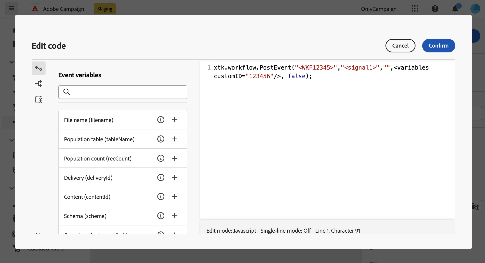

# 外部信号 {#external-signal}

<!--External Signal End-->

>[!CONTEXTUALHELP]
>id="acw_orchestration_externalsignal"
>title="外部信号"
>abstract="**外部信号**&#x200B;活动允许您从另一个工作流或 API 调用触发工作流的执行。"

>[!CONTEXTUALHELP]
>id="acw_orchestration_externalsignal_parameters"
>title="外部信号参数"
>abstract="外部信号参数"

>[!CONTEXTUALHELP]
>id="acw_orchestration_end_trigger"
>title="结束触发器"
>abstract="结束触发器"

此 **外部信号** 活动是 **流量控制** 活动。 它允许您通过其他工作流或API调用触发工作流的执行。

>[!NOTE]
>
>本页介绍配置 **[!UICONTROL 外部信号]** 活动，并从另一个工作流或API调用触发该活动。 有关如何触发工作流及其最佳实践，以及如何使用Campaign API的详细信息，请参阅 [Campaign v8（客户端控制台）文档](https://experienceleague.adobe.com/en/docs/campaign/automation/workflows/advanced-management/javascript-in-workflows#trigger-example)

按照以下步骤配置 **外部信号** 活动并触发其执行：

1. 添加 **外部信号** 活动添加到工作流中。

1. 完成工作流的配置并开始执行。 此 **[!UICONTROL 外部信号]** 活动显示为“挂起”，正在等待触发。

   

1. 检索以下信息：

   * 此 **工作流的内部名称**，会在标签旁边显示。

     +++查看示例

     

+++

   * 此 **外部信号活动的名称**，显示在工作流的 **[!UICONTROL 执行选项]**.

     +++查看示例

     

+++

1. 要触发工作流，您需要执行 `PostEvent` JavaScript函数。 此函数允许您使用选择的值传递变量，并在触发的工作流中利用这些变量。

   此 `PostEvent` 函数可以从另一个工作流或API调用执行。

   * 触发 **[!UICONTROL 外部信号]** 活动时，执行PostEvent函数 **[!UICONTROL 初始化脚本]** 窗格，可从活动的 **[!UICONTROL 执行选项]**. 对于 **[!UICONTROL JavaScript代码]** 活动，从活动的脚本中执行函数。

     语法如下：

     ```
     xtk.workflow.PostEvent("<workflow-internal-name>","<signal-activity-name>","",<variables <variable-name>="<value>"/>, false);
     ```

   +++查看示例

   在此示例中，我们将触发已添加到其内部名称为“WKF12345”的工作流的“signal1”外部信号活动。 我们还将传递一个名为“customID”的变量，其值为“123456”。

   

+++

   * 触发 **[!UICONTROL 外部信号]** API调用中的活动，请按照Campaign API文档中详述的步骤操作。 [了解如何使用静态 `PostEvent` 方法](https://experienceleague.adobe.com/developer/campaign-api/api/sm-workflow-PostEvent.html)
