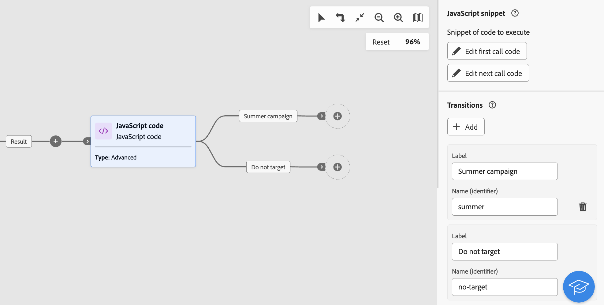

# JavaScript 代码 {#javascript-code}

>[!CONTEXTUALHELP]
>id="acw_orchestration_javascript"
>title="JavaScript 代码"
>abstract="**JavaScript 代码**&#x200B;活动允许您在工作流上下文中执行 JavaScript 脚本。您可以使用它来执行操作或从数据库收集信息。使用&#x200B;**简单的** JavaScript 代码活动在执行工作流时执行一个代码片段。**高级** Javascript 代码活动允许您通过按顺序执行两个不同的代码片段来执行更复杂的操作。工作流第一次启动时，会执行第一个调用。工作流每次再次运行时，都会执行第二次调用中定义的代码。"

>[!CONTEXTUALHELP]
>id="acw_orchestration_javascript_snippet"
>title="JavaScript 代码片段"
>abstract="定义运行活动时要执行的脚本。如果您正在配置&#x200B;**高级** JavaScript 活动，则需要编辑两个代码片段：在第一次执行工作流时执行的第一个调用代码，以及在下一次调用工作流时执行的下一个调用代码。"

>[!CONTEXTUALHELP]
>id="acw_orchestration_javascript_execution"
>title="JavaScript 执行"
>abstract="配置延迟执行，以便在执行一段时间后停止活动。默认情况下，执行阶段不能超过 1 小时。延迟之后，该进程将会中止并会显示错误消息，并且活动执行会失败。若要忽略此限制，请将该值设置为 0。"

>[!CONTEXTUALHELP]
>id="acw_orchestration_javascript_transition"
>title="JavaScript 过渡"
>abstract="如果要添加多个输出过渡，请点击&#x200B;**[!UICONTROL 添加过渡]**&#x200B;按钮。例如，这允许您根据 JavaScript 代码活动中定义的特定条件来触发特定的过渡。此选项仅适用于&#x200B;**高级** JavaScript 代码活动。"

此 **JavaScript代码** 活动是 **数据管理** 活动。 使用此活动可在工作流的上下文中执行JavaScript脚本。 这允许您从数据库收集信息或执行其他复杂操作。

## 配置JavaScript代码活动 {#javascript-code-configuration}

按照以下步骤配置 **JavaScript代码** 活动：

1. 添加 **JavaScript代码** 活动添加到工作流中。

1. 选择要创建的活动类型：

   * **简单**：执行一个代码片段。
   * **高级**：利用此选项，您可以通过执行两个不同的代码片段来执行更高级的操作。 [了解如何配置高级JavaScript活动](#advanced)

   >[!NOTE]
   >
   >通过Campaign Web用户界面，我们通过将两个活动合并在一起，将两个活动合并在一起 **简单** 和 **高级** JavaScript代码功能。 此合并不会以任何方式影响该活动的功能。

1. 确认，然后单击 **[!UICONTROL 编辑代码]** 按钮以打开表达式编辑器。 左侧窗格提供了预定义的语法，您可以利用它来构建代码，包括事件变量。 [了解如何使用事件变量和表达式编辑器](../event-variables.md)

   

1. 在 **[!UICONTROL 执行]** 部分，将延迟配置为在执行一段时间后停止活动。 默认情况下，执行阶段不能超过 1 小时。延迟之后，该进程将会中止并会显示错误消息，并且活动执行会失败。若要忽略此限制，请将该值设置为 0。

   

1. 打开 **[!UICONTROL 进程错误]** 选项可将脚本执行期间发生的错误保留在附加输出转换中。

## 高级JavaScript代码活动 {#advanced}

高级JavaScript活动允许您执行复杂的操作。 它允许您：

* 执行两个不同的代码段。 在第一次启动工作流时执行第一个代码片段。 每次再次运行工作流时，都会执行第二次调用中定义的代码片段。
* 添加多个可使用脚本动态交互的输出过渡。

要配置高级JavaScript代码活动，请执行以下步骤：

1. 选择 **高级** 键入，然后配置要执行的代码片段：

   * 单击 **[!UICONTROL 编辑第一个呼叫代码]** 定义要在第一次调用期间执行的脚本。
   * 单击 **[!UICONTROL 编辑下一个呼叫代码]** 定义在工作流下次调用期间执行的脚本。 （可选）

1. 要添加一个或多个输出过渡，请单击 **[!UICONTROL 添加过渡]** 按钮，并为每个过渡指定标签和内部名称。

   在此示例中，我们配置了两个由脚本根据特定条件在代码片段中激活的过渡。

   

1. 完成活动的配置并启动工作流。

## 示例 {#javascript-code-example}

### 根据传入群体初始化变量 {#example1}

此示例说明如何根据工作流定向的用户档案数初始化变量。


在本例中，我们定位的是数据库中的VIP用户档案。 我们希望创建一个名为“channel”的变量，该变量的值取决于构建受众活动定向的用户档案数：

* 如果目标用户档案超过1000个，则使用值“email”初始化变量。
* 否则，使用值“sms”初始化它。

为此，请执行以下步骤：

1. 添加 **JavaScript代码** 具有类型的活动 **简单** 之后 **构建受众** 活动。

1. 单击 **编辑代码** 并如下所示配置代码片段：

   ```
   if (vars.recCount > 1000)
       vars.channel ="email"
   else
       vars.channel = "sms"
   ```

1. 启动工作流。 将使用“email”或“sms”值创建“channel”变量，具体取决于 **构建受众** 活动。

### 根据变量的值触发过渡 {#example2}

此示例说明如何根据变量的值触发过渡。


在此，工作流以 **外部信号** 活动，其中变量(`interest`)传递。 变量的值为“正在运行”或“瑜伽”，具体取决于在初始工作流中执行的筛选操作。

我们希望根据变量的值，在工作流中触发不同的过渡。

为此，请执行以下步骤：

1. 添加 **JavaScript代码** 外部信号活动后的活动，类型 **高级**.

1. 添加两个过渡：每个可能的变量值（“正在运行”、“瑜伽”）各一个。

1. 单击 **编辑第一个呼叫代码** 并如下所示配置代码片段：

   ```
   if (vars.interest=="running")
       task.postEvent(task.transitionByName("running"));
   else
       task.postEvent(task.transitionByName("yoga"));
   ```

1. 根据需要完成每个过渡的配置，然后启动工作流。 两个输出转换中的其中一个已激活，其值基于 `interest` 变量传递给 **外部信号** 活动。
