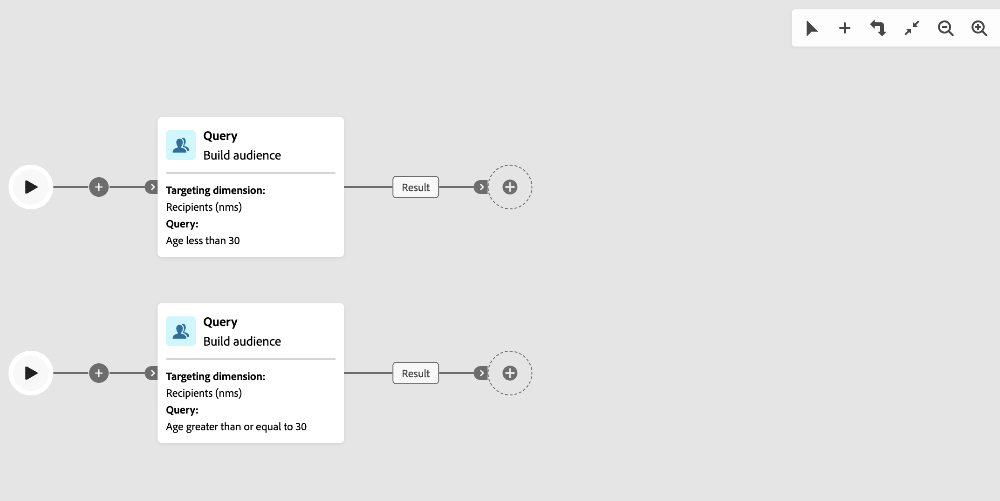

# 加入 {#join}

>[!CONTEXTUALHELP]
>id="acw_homepage_welcome_rn5"
>title="多个工作流分支和连接活动"
>abstract="现在支持多个分支。 您可以单击工具栏上的“添加分支”，而不是使用“分支”。 合并连接活动也已得到改进。 它现在是一个通用的“连接”活动，允许您在“与”和“或”连接选项之间进行选择。"
>additional-url="https://experienceleague.adobe.com/docs/campaign-web/v8/release-notes/release-notes.html?lang=zh-hans" text="请参阅发行说明"

>[!CONTEXTUALHELP]
>id="acw_orchestration_and-join"
>title="AND-join 活动"
>abstract="利用 **And-join** 活动，可同步工作流的多个执行分支。一旦完成所有之前的活动，即会触发该活动。这可确保在继续执行工作流之前完成某些活动。"

>[!CONTEXTUALHELP]
>id="acw_orchestration_join"
>title="Join 活动"
>abstract="**加入**&#x200B;活动允许您合并多个集客过渡。 选择是否在完成所有集客过渡后继续(AND)，或是否在完成任何集客过渡后继续(OR)。"

**加入**&#x200B;活动是&#x200B;**流控制**&#x200B;活动。 它同步工作流的多个执行分支。
您可以选择评估集客过渡的方式：

* **AND**：仅在激活所有选定的集客过渡后继续。
* **OR**：激活一个选定的集客过渡后立即继续。

选择&#x200B;**AND**&#x200B;时，此活动仅在激活所有集客过渡后触发其集客过渡。 换句话说，一旦完成之前的所有活动，就会激活该活动。 这可确保在继续执行工作流之前已完成某些活动。

选择&#x200B;**或**&#x200B;后，只要激活其中一个选定的集客过渡，就会立即继续执行。 它不会等待每一个分支。

## 配置加入活动 {#join-configuration}

>[!CONTEXTUALHELP]
>id="acw_orchestration_and-join_merging"
>title="合并选项"
>abstract="选择您要参加的活动。在&#x200B;**主要集合**&#x200B;下拉列表中，选择要保留的集客过渡群体。"

按照以下步骤配置&#x200B;**加入**&#x200B;活动：

1. 添加多个活动（如渠道活动）以形成至少两个不同的执行分支。 您可以使用&#x200B;**分支**&#x200B;或使用&#x200B;**添加分支** (+)工具栏按钮添加单独的分支。 查看[编排活动](../orchestrate-activities.md#toolbar)。

   

1. 将&#x200B;**加入**&#x200B;活动添加到任何分支。

   

1. 在连接选项中，选择&#x200B;**AND**&#x200B;或&#x200B;**OR**，然后单击&#x200B;**继续**。
1. 在&#x200B;**合并选项**&#x200B;部分中，选中之前要加入的所有活动。
1. 在&#x200B;**主集**&#x200B;下拉列表中，选择要保留的集客过渡群体。 叫客过渡只能包含集客过渡群体之一。

   >[!NOTE]
   >
   >**主集**&#x200B;字段仅可用于&#x200B;**AND**&#x200B;连接选项。

   

## 示例 {#join-example}

以下示例显示了两个工作流分支，其中包含电子邮件和短信投放。启用两个集客过渡时，将触发&#x200B;**加入**&#x200B;活动（设置为&#x200B;**AND**）。 推送通知仅在两个投放均完成后发送。 如果将加入选项设置为&#x200B;**或**，则将在完成第一个入站投放活动后立即发送推送消息。

{zoomable="yes"}