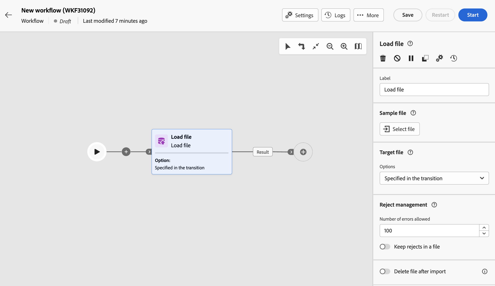

# 加载文件 {#load-file}

>[!CONTEXTUALHELP]
>id="acw_orchestration_loadfile"
>title="加载文件活动"
>abstract=" **加载文件**&#x200B;活动是一项&#x200B;**数据管理**&#x200B;活动。使用此活动处理存储在外部文件中的数据。 用户档案和数据不会添加到数据库中，但输入文件中的所有字段可用于进行个性化、更新用户档案或任何其他表。 "

>[!CONTEXTUALHELP]
>id="acw_orchestration_loadfile_outboundtransition"
>title="拒绝管理出站过渡"
>abstract="拒绝管理出站过渡"

>[!CONTEXTUALHELP]
>id="acw_orchestration_loadfile_outboundtransition_reject"
>title="针对拒绝的拒绝管理出站过渡"
>abstract="针对拒绝的拒绝管理出站过渡"

 **加载文件**&#x200B;活动是一项&#x200B;**数据管理**&#x200B;活动。使用此活动可使用存储在外部文件中的用户档案和数据。 用户档案和数据不会添加到数据库中，但输入文件中的所有字段都可用于 [个性化](../../personalization/gs-personalization.md)，或者更新用户档案或任何其他表。

>[!NOTE]
>支持的文件格式有：文本 (TXT) 和逗号分隔值 (CSV)。您可以加载最大大小为50MB的文件。

此活动可与 [调解](reconciliation.md) 活动，用于将未识别的数据链接到现有资源。 例如， **加载文件** 活动可放在之前 **调解** 活动。

## 配置加载文件活动 {#load-configuration}

此 **加载文件** 活动配置包含两个步骤。 首先，您需要通过上传样例文件来定义预期的文件结构。完成此操作后，您可以指定要导入其数据的文件的来源。 请按照以下步骤配置活动。

### 配置样例文件 {#sample}

>[!AVAILABILITY]
>
>此功能位于有限可用性(LA)中。 它仅限在Campaign服务器v8.7上运行的客户使用，不能部署在任何其他环境中。

>[!CONTEXTUALHELP]
>id="acw_orchestration_loadfile_samplefile"
>title="示例文件"
>abstract="通过上传样例文件选择预期的文件结构。"

>[!CONTEXTUALHELP]
>id="acw_orchestration_loadfile_formatting"
>title="加载文件活动的格式设置"
>abstract="在 **格式化** 部分，指定文件的格式以确保正确导入数据。"

>[!CONTEXTUALHELP]
>id="acw_orchestration_loadfile_valueremapping"
>title="“加载文件”活动的值重新映射"
>abstract="使用此选项可使用新值映射加载文件中的特定值。 例如，如果列包含“True”/“False”值，则可以添加映射以自动将这些值替换为“0”/“1”字符。"

按照以下步骤配置用于定义预期文件结构的样例文件：

1. 添加 **加载文件** 活动添加到工作流中。

1. 选择用于定义预期文件结构的样例文件。 要执行此操作，请单击 **选择文件** 中的按钮 **[!UICONTROL 示例文件]** 部分并选择要使用的本地文件。

   >[!NOTE]
   >
   >并不会导入样例文件的数据，仅将其用于配置活动。我们建议使用包含少量数据的样例文件。 文件格式必须与此对齐 [示例文件](../../audience/file-audience.md#sample-file).

1. 此时将显示样例文件的预览，最多显示30行。

1. 在 **[!UICONTROL 文件类型]** 下拉列表，指定文件使用的是分隔列还是固定宽度列。

   

1. 对于分隔列的文件类型，请使用 **列** 部分，以配置每列的属性。

   +++文件列的可用选项

   * **[!UICONTROL 标签]**：为列显示的标签。
   * **[!UICONTROL 数据类型]**：列中包含的数据类型。
   * **[!UICONTROL 宽度]** （字符串数据类型）：列中可显示的最大字符数。
   * **[!UICONTROL 数据转换]** （字符串数据类型）：将转换应用于列中包含的值。
   * **[!UICONTROL 空格管理]** （字符串数据类型）：指定如何管理列中包含的空格。
   * **[!UICONTROL 分隔符]** （日期、时间、整数和数字数据类型）*：指定要用作分隔符的字符。
   * **[!UICONTROL 允许NULL]**：指定如何管理列中的空值。 如果存在空值，“Adobe Campaign默认值”选项将引发错误。
   * **[!UICONTROL 处理时出错]** （字符串数据类型）：指定其中一行出错时的行为。
   * **[!UICONTROL 值重新映射]**：利用此选项可使用新值映射特定值。 例如，如果列包含“True”/“False”值，则可以添加映射以自动将这些值替换为“0”/“1”字符。

+++

1. 在 **格式化** 部分，指定文件的格式以确保正确导入数据。

### 定义要上传的目标文件 {#target}

>[!CONTEXTUALHELP]
>id="acw_orchestration_loadfile_targetfile"
>title="“加载文件”活动的目标文件"
>abstract="在 **[!UICONTROL 目标文件]** 部分，指定如何检索要在服务器上上传的文件。"

>[!CONTEXTUALHELP]
>id="acw_orchestration_loadfile_nameofthefile"
>title="文件名称"
>abstract="指定要在服务器上上载的字段的名称。 单击 **[!UICONTROL 打开个性化对话框]** 图标以利用表达式编辑器（包括事件变量）计算文件名。"

>[!CONTEXTUALHELP]
>id="acw_orchestration_loadfile_targetdb"
>title="目标数据库"
>abstract="如果您要访问 **[!UICONTROL 加载文件]** 已在客户端控制台中设置的活动，这是一项 **[!UICONTROL 目标数据库]** 如果已将活动配置为将文件上载到外部数据库，则部分可用。"

>[!CONTEXTUALHELP]
>id="acw_orchestration_loadfile_command"
>title="加载文件命令"
>abstract="允许使用任意命令进行预处理会带来安全问题，禁用安全选项 XtkSecurity_Disable_Preproc 可强制使用一系列预定义的命令。"

>[!CAUTION]
>
>在加载目标文件之前，请确保它遵守示例文件格式。 文件格式、列结构或列数的任何差异都可能导致工作流执行期间出现错误。

1. 在 **[!UICONTROL 目标文件]** 部分，指定检索要在服务器上上载的文件时要执行的操作。

   * **[!UICONTROL 从本地计算机上传文件]**：选择要从计算机上传的文件。

   * **[!UICONTROL 在过渡中指定]**：上传集客过渡中指定的文件，该文件即将从上一个活动(例如 **[!UICONTROL 传输文件]**.

   * **[!UICONTROL 预处理文件]**：上传在上一个过渡中指定的文件，并对其应用预处理命令，例如 **[!UICONTROL 解压缩]** 或 **[!UICONTROL 解密]**.

   * **[!UICONTROL 已计算]**：上传在中指定名称的文件 **[!UICONTROL 文件名]** 字段。 单击 **[!UICONTROL 打开个性化对话框]** 图标以利用表达式编辑器（包括事件变量）计算文件名。

   

   >[!NOTE]
   >
   >如果您要访问 **[!UICONTROL 加载文件]** 已在客户端控制台中设置的活动，这是一项 **[!UICONTROL 目标数据库]** 如果已将活动配置为将文件上载到外部数据库，则会显示部分。 它允许您指定是将文件上传到Campaign服务器还是外部数据库。

### 其他选项 {#options}

>[!CONTEXTUALHELP]
>id="acw_orchestration_loadfile_rejectmgt"
>title="加载文件活动的拒绝管理"
>abstract="在 **拒绝管理** 部分，指定活动在出现错误时的行为方式。 您可以定义允许的最大错误数，并切换 **[!UICONTROL 将拒绝保留在文件中]** 选项，用于在服务器上下载包含导入期间发生错误的文件。"

>[!CONTEXTUALHELP]
>id="acw_orchestration_loadfile_delete"
>title="导入后删除文件"
>abstract="切换&#x200B;**”导入后删除文件“**，可在导入文件后从服务器中删除原始文件。"

>[!AVAILABILITY]
>
>这些选项在有限可用性(LA)中提供。 它们仅限于在Campaign服务器v8.7上运行的客户，不能部署在任何其他环境中。

1. 在 **拒绝管理** 部分，指定活动在出现错误时的行为方式：

   * 在 **[!UICONTROL 德勒]** 字段，指定处理要加载的文件时授权的最大错误数。 例如，如果该值设置为“20”，则当加载文件时出现20个以上的错误时，工作流执行将失败。

   * 要保留加载文件时发生的错误，请切换 **[!UICONTROL 将拒绝保留在文件中]** 选项，并在中为文件指定所需的名称 **[!UICONTROL 拒绝文件]** 字段。

     激活此选项后，在活动后会添加一个名为“补充”的其他输出过渡。 导入期间发生的任何错误都将存储在服务器上的指定文件中。

1. 要在执行工作流后从服务器中删除上传的文件，请切换 **[!UICONTROL 导入后删除文件]** 选项。

   

1. 在确认设置正确后，单击&#x200B;**确认**。

## 示例 {#load-example}

外部文件加载示例，用于 **调解** 活动的可用位置 [本节](reconciliation.md#reconciliation-example).
