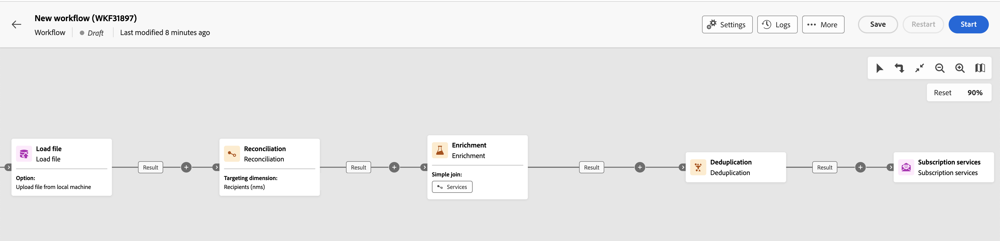
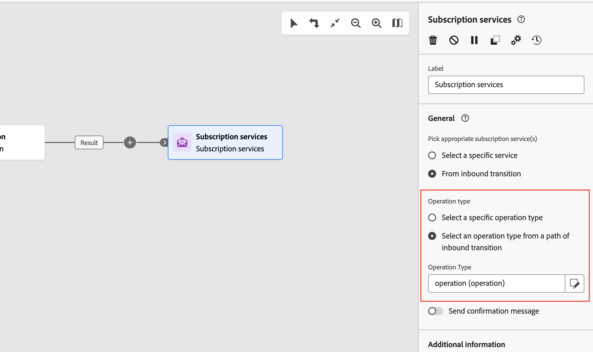

# 订阅服务 {#subscription-services}

>[!CONTEXTUALHELP]
>id="acw_orchestration_subscription"
>title="订阅服务活动"
>abstract="订阅服务活动允许在一个操作中订阅或取消订阅多个配置文件。"

>[!CONTEXTUALHELP]
>id="acw_orchestration_subscription_general"
>title="订阅服务常规参数"
>abstract="选择所需的服务，然后选择要执行的操作（订阅或取消订阅）。切换&#x200B;**发送确认消息**&#x200B;选项，通知群体他们已订阅或取消订阅所选服务。"

>[!CONTEXTUALHELP]
>id="acw_orchestration_subscription_outboundtransition"
>title="生成出站过渡"
>abstract="切换&#x200B;**“生成出站过渡”**&#x200B;选项，可在活动后添加过渡。"

>[!CONTEXTUALHELP]
>id="acw_orchestration_subscription_additionalinfo"
>title="其他信息"
>abstract="其他信息"

**订阅服务**&#x200B;活动是&#x200B;**数据管理**&#x200B;活动。 它允许您为过渡中指定的群体创建或删除对信息服务的订阅。

## 配置订阅服务活动 {#subscription-services-configuration}

按照以下步骤配置&#x200B;**订阅服务**&#x200B;活动：

1. 将&#x200B;**订阅服务**&#x200B;活动添加到您的工作流中。 定向用户档案或导入包含已识别数据的文件后，即可使用此活动。

1. 使用以下选项之一选择要为其管理订阅的服务：

   * **[!UICONTROL 选择特定服务]**：使用&#x200B;**[!UICONTROL 服务]**&#x200B;字段手动选择服务。

   * **[!UICONTROL 来自入站过渡]**：使用在入站过渡中指定的服务。 例如，可以导入一个文件，在该文件中指定用于管理各行的服务。然后，会为每个配置文件动态选择要对其执行操作的服务。

   

1. 选择要执行的操作： **订阅**&#x200B;或&#x200B;**取消订阅**。

   如果在集客过渡中定义了服务，则可以选择如何检索此操作：

   * **选择特定操作类型**：手动选择要执行的操作（**订阅**&#x200B;或&#x200B;**取消订阅**）

   * **从集客过渡路径中选择操作类型**：选择指定为每个记录执行的操作的集客数据列。 例如，可以导入一个文件，该文件指定对“operation”列中的每行执行的操作。

     此处只能选择boolean或integer字段。 确保包含要执行的操作的数据与此格式匹配。 例如，如果从加载文件活动加载数据，请检查是否已在&#x200B;**[!UICONTROL 加载文件]**&#x200B;活动中正确设置包含该操作的列的格式。 [此部分](#uc2)中提供了一个示例。

     >[!CAUTION]
     >
     >默认情况下，如果选择此选项，**订阅服务**&#x200B;活动将预期具有指向工作流中设置的&#x200B;**服务(nms)**&#x200B;表的链接定义。 为此，请确保已在工作流中的&#x200B;**扩充活动**&#x200B;上配置了协调链接。 [此处](#uc2)提供了有关如何使用此选项的示例。

   

1. 要通知收件人他们已订阅或取消订阅所选服务，请启用&#x200B;**[!UICONTROL 发送确认消息]**&#x200B;选项。 该通知的内容在与信息服务相关联的投放模板中定义。

1. 如果您使用的是来自集客过渡的数据，则会显示&#x200B;**[!UICONTROL 其他信息]**&#x200B;部分，允许您为每个记录指定数据和订阅来源。 您可以将此部分留空，这样在运行工作流时就不会设置日期或来源。

   * 如果集客数据包含一列，指示用户档案订阅服务的日期，则可以在&#x200B;**[!UICONTROL Date]**&#x200B;字段中选择该列。

   * 在&#x200B;**[!UICONTROL 原始路径]**&#x200B;字段中，定义订阅的来源。 您可以将其设置为集客数据的一个字段，也可以通过选中&#x200B;**[!UICONTROL 将常量设置为origin]**&#x200B;选项将其设置为您选择的常量值。

   

1. 要在活动后添加叫客过渡，请打开&#x200B;**[!UICONTROL 生成叫客过渡]**&#x200B;选项。

## 示例 {#example}

### 将受众订阅到特定服务 {#uc1}

此工作流显示如何让受众订阅现有服务。


* **[!UICONTROL 生成受众]**&#x200B;活动以现有受众为目标。

* **[!UICONTROL 订阅服务]**&#x200B;活动允许您选择用户档案必须订阅的服务。

### 从文件更新多个订阅状态 {#uc2}

以下工作流显示如何导入包含用户档案的文件，并将其订阅更新为文件中指定的多项服务。



* **[!UICONTROL 加载文件]**&#x200B;活动加载包含数据的CSV文件并定义导入列的结构。 “服务”和“操作”列指定要更新的服务和要执行的操作（订阅或退订）。

  ```
  Lastname,firstname,city,birthdate,email,service,operation
  Smith,Hayden,Paris,23/05/1985,hayden.smith@example.com,yoga,sub
  Mars,Daniel,London,17/11/1999,danny.mars@example.com,running,sub
  Smith,Clara,Roma,08/02/1979,clara.smith@example.com,running,unsub
  Durance,Allison,San Francisco,15/12/2000,allison.durance@example.com,yoga,sub
  Durance,Alison,San Francisco,15/12/2000,allison.durance@example.com,running,unsub
  ```

  如您所见，文件中的操作为“订阅”或“退订”。系统需要 **Boolean** 或 **Integer** 值以识别要执行的操作：“0”代表退订，“1”代表订阅。要符合此要求，请执行以下操作：
   * “operation”列的&#x200B;**数据类型**&#x200B;设置为整数。
   * 必须执行&#x200B;**值重新映射**，以将“sub”和“unsub”值与“1”和“0”值相匹配。

  

  如果文件已使用“0”和“1”来标识操作，则无需重映射这些值。仅确保将该列作为&#x200B;**Boolean**&#x200B;或&#x200B;**Integer**&#x200B;在示例文件列中进行处理。

* **[!UICONTROL 协调]**&#x200B;活动将来自文件的数据标识为属于Adobe Campaign数据库的配置文件维度。 文件的&#x200B;**email**&#x200B;字段与配置文件资源的&#x200B;**email**&#x200B;字段匹配。

  

* **[!UICONTROL 扩充]**&#x200B;活动会创建指向“服务(nms)”表的协调链接，该链接在上传文件的“服务”列与数据库中的“内部名称”服务字段之间具有简单联接。

  

* **[!UICONTROL 订阅服务]**&#x200B;标识要更新的服务来自过渡。

  将&#x200B;**[!UICONTROL 操作类型]**&#x200B;标识为来自文件的&#x200B;**操作**&#x200B;字段。 此处只能选择 Boolean 或 Integer 字段。如果列表中未显示包含要执行操作的文件列，请确保已根据本例前面部分所述，在&#x200B;**[!UICONTROL 加载文件]**&#x200B;活动中正确设置了列格式。

  
