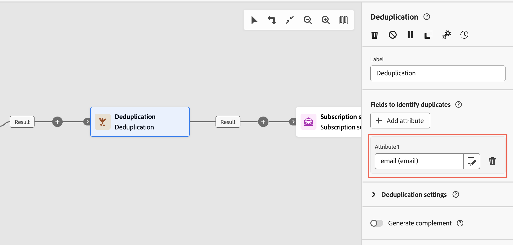

# 订阅服务 {#subscriptipon-services}

>[!CONTEXTUALHELP]
>id="acw_orchestration_subscription"
>title="订阅服务活动"
>abstract="订阅服务活动允许在一个操作中订阅或取消订阅多个配置文件。"

>[!CONTEXTUALHELP]
>id="acw_orchestration_subscription_general"
>title="订阅服务常规参数"
>abstract="选择所需的服务，然后选择要执行的操作（订阅或取消订阅）。切换&#x200B;**发送确认消息**&#x200B;选项，通知群体他们已订阅或取消订阅所选服务。"

>[!CONTEXTUALHELP]
>id="acw_orchestration_subscription_outboundtransition"
>title="生成出站过渡"
>abstract="切换&#x200B;**“生成出站过渡”**&#x200B;选项，可在活动后添加过渡。"

此 **订阅服务** 活动是 **数据管理** 活动。 它允许您为过渡中指定的群体创建或删除对信息服务的订阅。

## 配置订阅服务活动 {#subscription-services-configuration}

按照以下步骤配置 **订阅服务** 活动：

1. 添加 **订阅服务** 活动添加到工作流中。 定向用户档案或导入包含已识别数据的文件后，即可使用此活动。

1. 使用以下选项之一选择要为其管理订阅的服务：

   * **[!UICONTROL 选择特定服务]**：使用手动选择服务 **[!UICONTROL 服务]** 字段。

   * **[!UICONTROL 从集客过渡]**：使用集客过渡中指定的服务。 例如，可以导入一个文件，在该文件中指定用于管理各行的服务。然后，会为每个配置文件动态选择要对其执行操作的服务。

   

1. 选择要执行的操作： **订阅** 或 **取消订阅**.

   如果在集客过渡中定义了服务，则可以选择如何检索此操作：

   * **选择特定操作类型**：手动选择要执行的操作(**订阅** 或 **取消订阅**)

   * **从集客过渡路径中选择操作类型**：选择集客数据的列，在该列中指定要对每个记录执行的操作。 例如，可以导入一个文件，该文件指定对“operation”列中的每行执行的操作。

     >[!NOTE]
     >
     >此处只能选择boolean或integer字段。 确保包含要执行的操作的数据与此格式匹配。 例如，如果从加载文件活动加载数据，请检查您是否正确设置了中包含操作的列的格式 **[!UICONTROL 加载文件]** 活动。 有关示例，请参见 [本节](#uc2).

   

1. 要通知收件人他们已订阅或取消订阅所选服务，请切换 **[!UICONTROL 发送确认消息]** 选项启用。 该通知的内容在与信息服务相关联的投放模板中定义。

1. 如果您使用的是来自集客过渡的数据，则 **[!UICONTROL 其他信息]** 部分显示，允许您指定每个记录的数据和订阅来源。 您可以将此部分留空，这样在运行工作流时就不会设置日期或来源。

   * 如果集客数据包含一列，指示用户档案订阅服务的日期，则可以在以下位置选择它： **[!UICONTROL 日期]** 字段。

   * 在 **[!UICONTROL 源路径]** 字段，定义订阅的来源。 您可以将其设置为集客数据的一个字段，也可以通过检查 **[!UICONTROL 将常量设置为原点]** 选项。

   

1. 要在活动后添加叫客过渡，请切换 **[!UICONTROL 生成叫客过渡]** 选项启用。

## 示例 {#example}

### 将受众订阅到特定服务 {#uc1}

此工作流显示如何让受众订阅现有服务。


* A **[!UICONTROL 构建受众]** 活动面向现有受众。

* A **[!UICONTROL 订阅服务]** 通过活动，选择用户档案必须订阅的服务。

<!--
### Updating multiple subscription statuses from a file {#uc2}

The workflow below shows how to import a file containing profiles and update their subscription to several services specified in the file.


* A **[!UICONTROL Load file]** activity loads a CSV file containing the data and defines the structure of the imported columns. The "service" and "operation" columns specify the service to update and the operation to perform (subscription or unsubscription).

  ```
  Lastname,firstname,city,birthdate,email,service,operation
  Smith,Hayden,Paris,23/05/1985,hayden.smith@example.com,yoga,sub
  Mars,Daniel,London,17/11/1999,danny.mars@example.com,running,sub
  Smith,Clara,Roma,08/02/1979,clara.smith@example.com,running,unsub
  Durance,Allison,San Francisco,15/12/2000,allison.durance@example.com,yoga,sub
  Durance,Alison,San Francisco,15/12/2000,allison.durance@example.com,running,unsub
  ```

  As you may have noticed, the operation is specified in the file as "sub" or "unsub". The system expects a **Boolean** or **Integer** value to recognize the operation to perform: "0" to unsubscribe and "1" to subscribe. To match this requirement, a remapping of values must be performed in the detail of the "operation" column in the sample file configuration screen.

  

  If your file already uses "0" and "1" to identify the operation, you don't need to remap those values. Only make sure that the column is processed as a **Boolean** or **Integer** in the sample file columns.

* A **[!UICONTROL Reconciliation]** activity identifies the data from the file as belonging to the profile dimension of the Adobe Campaign database. The **email** field of the file is matched to the **email** field of the profile resource.

  

* An **[!UICONTROL Enrichment]** activity creates a link to the "Services (nms)" table and creates a simple join between the "service" column of the uploaded file, and the services "internal name" field in the database.

    

* A **[!UICONTROL Deduplication]** based on the **email** field identifies duplicates. It is important to eliminate duplicates since the subscription to a service will fail for all data in case of duplicates.

  
  
* A **[!UICONTROL Subscription Services]** identifies the services to update as coming from the transition, through the link created in the **[!UICONTROL Reconciliation]** activity.

  The **[!UICONTROL Operation type]** is identified as coming from the **operation** field of the file. Only Boolean or Integer fields can be selected here. If the column of your file that contains the operation to perform does not appear in the list, make sure that you have correctly set your column format in the **[!UICONTROL Load file]** activity, as explained earlier in this example.

  -->
