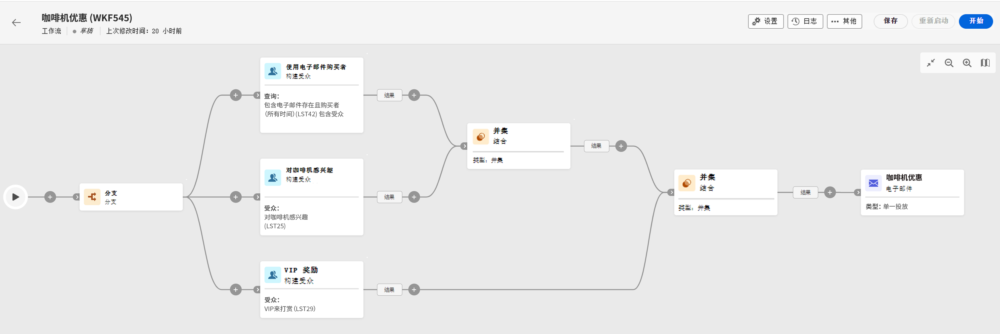

# 创建工作流的主要原则 {#gs-workflow-creation}

通过 Campaign v8 Web，可使工作流成为视觉画布的组成部分，以设计跨渠道流程，如分段、执行营销活动和处理文件。

可以从以下位置将工作流创建为独立工作流： **工作流** 菜单，或直接在营销策划中创建，在这种情况下，工作流将链接到营销策划，并与所有其他营销策划的工作流一起执行。

## 工作流中有什么？ {#gs-workflow-inside}

工作流图表示应该发生什么。它描述要执行的各种任务及其如何链接在一起。

每个工作流包含：

* **活动**：活动是要执行的任务。在图上用图标表示各种活动。每个活动都有特定属性和所有活动共有的其他属性。

  在工作流图中，一个给定活动可产生多个任务，尤其是存在循环或重复发生的行动时。

* **过渡**：过渡将源活动链接到目标活动并定义它们的顺序。

* **工作表**：工作表包含了过渡所携带的所有信息。每个工作流均使用多个工作表。这些表中传送的数据可在工作流的整个生命周期中使用。

## 创建工作流程的关键步骤 {#gs-workflow-steps}

创建工作流程的关键步骤如下：

以下部分将详细介绍这些步骤：

1. [创建工作流并定义其属性](create-workflow.md)
1. [协调和配置活动](orchestrate-activities.md)
1. [配置工作流高级设置](workflow-settings.md)
1. [启动工作流并监视其执行](start-monitor-workflows.md)

