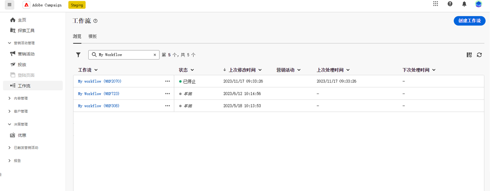
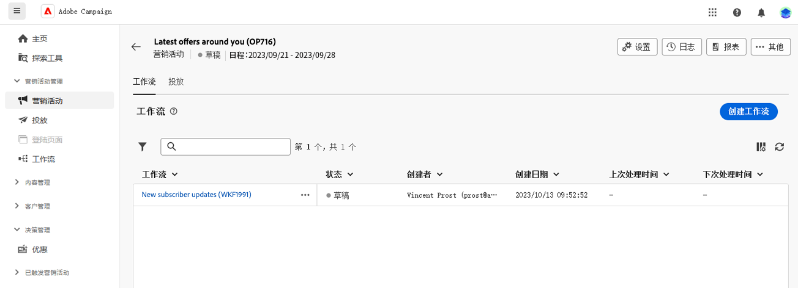

# 创建工作流的主要原则 {#gs-workflow-creation}

借助Adobe Campaign Web，您可以在可视画布上构建工作流以设计跨渠道流程，如分段、活动执行和文件处理。

## 工作流中有什么？ {#gs-workflow-inside}

工作流图表示计划的流程。 它描述要执行的各种任务及其如何链接在一起。

{zoomable="yes"}

每个工作流包含：

* **活动**：活动是要执行的任务。图表上的图标表示各种活动。 每个活动都具有所有活动共有的特定属性和属性。

  在工作流图中，给定活动可以生成多个任务，尤其是存在循环或重复操作时。

* **过渡**：过渡将源活动链接到目标活动并定义它们的顺序。

* **工作表**：工作表包含了过渡所携带的所有信息。每个工作流均使用多个工作表。这些表中的数据可在工作流的整个生命周期中使用。

## 创建工作流的关键步骤 {#gs-workflow-steps}

营销活动提供了两种创建工作流的方式：

1. 可以从&#x200B;**工作流**&#x200B;菜单将工作流创建为独立工作流。

   {zoomable="yes"}

1. 可以从营销策划的&#x200B;**工作流**&#x200B;选项卡直接在营销策划中创建工作流。 在营销策划中包含时，该工作流将与所有其他营销策划的工作流一起执行，并且报表量度会在营销策划级别分组。

   {zoomable="yes"}

创建工作流的关键步骤如下所示：

{zoomable="yes"}

以下各节将详细介绍这些步骤：

1. [创建您的工作流并定义其属性](create-workflow.md)
1. [编排和配置活动](orchestrate-activities.md)
1. [配置工作流高级设置](workflow-settings.md)
1. [启动工作流并监控其执行情况](start-monitor-workflows.md)