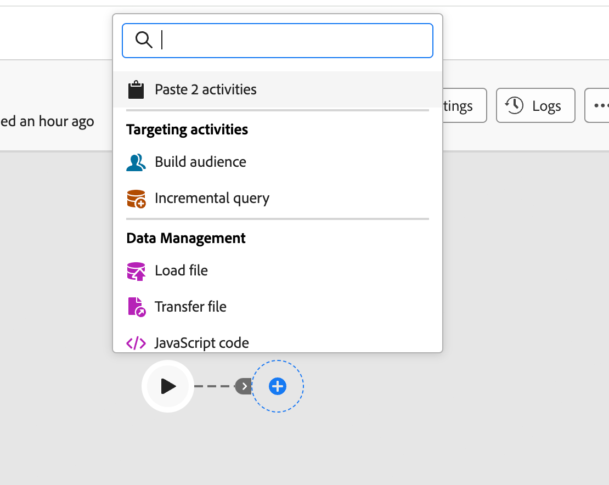
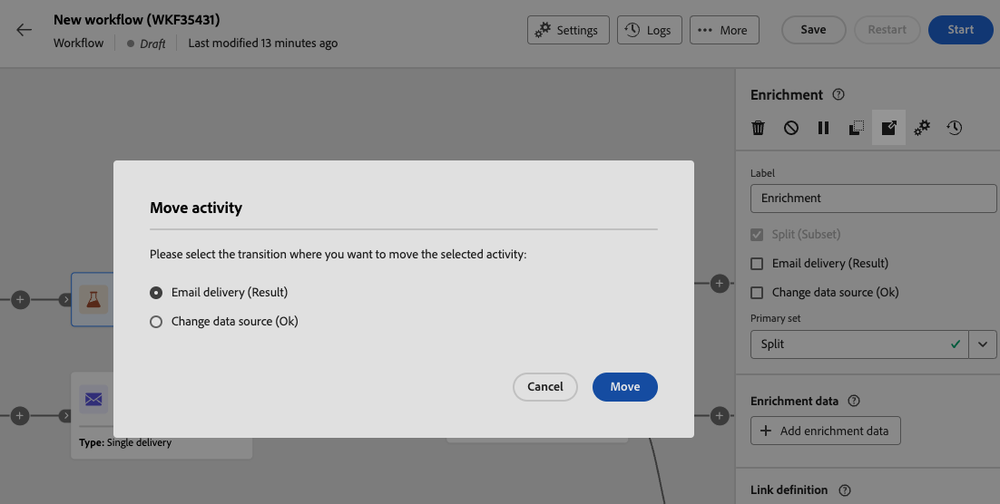
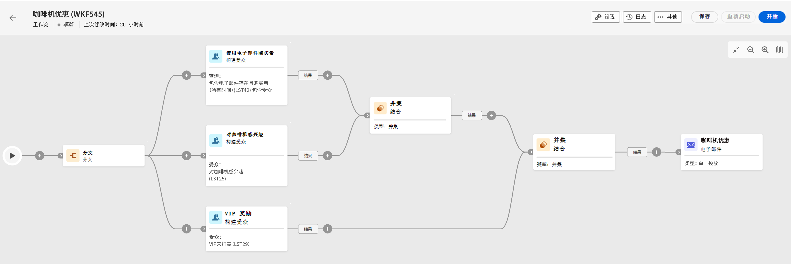

# 安排活动 {#orchestrate}

在您[创建工作流](create-workflow.md)后，无论是从工作流菜单还是在营销策划中，您都可以开始编排它执行的不同任务。 为此，提供了一个可视画布，允许您构建工作流图。 在此图表中，您可以添加各种活动并按顺序连接它们。

## 添加活动 {#add}

在配置的此阶段，将以开始图标显示图表，表示工作流的开始。 要添加您的第一个活动，请单击连接到开始图标的&#x200B;**+**&#x200B;按钮。

此时会显示可添加到图中的活动列表。 可用的活动取决于您在工作流图中的位置。 例如，添加第一个活动时，您可以通过以下方式启动工作流：定位受众、拆分工作流路径或设置&#x200B;**等待**&#x200B;活动以延迟工作流执行。 在&#x200B;**构建受众**&#x200B;活动后，您可以通过定位活动优化目标，通过渠道活动向受众发送投放，或通过流量控制活动组织工作流流程。

{zoomable="yes"}

将活动添加到图后，将显示右侧窗格，允许您使用特定设置配置新添加的活动。 有关如何配置每个活动的详细信息，请参阅[此部分](activities/about-activities.md)。

{zoomable="yes"}

重复此过程以根据需要添加任意数量的活动，具体取决于您的工作流执行的任务。 您还可以在两个活动之间插入新活动。 为此，请在活动之间的过渡上单击&#x200B;**+**&#x200B;按钮，选择所需的活动，然后在右侧窗格中对其进行配置。

要删除某个活动，请在画布中选择该活动，然后单击活动属性中的&#x200B;**删除**&#x200B;图标。

>[!TIP]
>
>您可以个性化每个活动之间的过渡名称。 要实现此目的，请选择过渡，然后在右窗格中更改其标签。

## 工具栏 {#toolbar}

工具栏位于画布的右上角，提供了用于轻松处理活动和在画布中导航的选项：

* **多重选择模式**：选择多个活动以一次删除所有活动或复制并粘贴它们。 请参阅[此小节](#copy)。
* **旋转**：垂直切换画布。
* **适合屏幕**：根据屏幕调整画布缩放级别。
* **缩小** / **放大**：缩小或缩小画布。
* **显示映射**：打开显示您位置的画布快照。

{zoomable="yes"}{width="50%"}

## 管理活动 {#manage}

添加活动时，属性窗格中提供了操作按钮，允许您执行多个操作。

{zoomable="yes"}

您可以：

* 从画布中&#x200B;**删除**&#x200B;活动。
* **禁用/启用**&#x200B;该活动。 执行工作流时，不会执行同一路径中禁用的活动和以下活动，并且工作流将停止。
* **暂停/继续**&#x200B;活动。 工作流执行时，会在暂停的活动中暂停。 相应的任务以及所有在同一路径中跟在该任务之后的任务将不会执行。
* **复制**&#x200B;活动。 请参阅[此小节](#copy)。
* **将**&#x200B;活动及其所有子节点移动到另一个过渡。 请参阅[此小节](#move)。
* 访问活动的&#x200B;**执行选项**。
* 访问活动的&#x200B;**日志和任务**。

若干&#x200B;**定位**&#x200B;活动（如&#x200B;**合并**&#x200B;或&#x200B;**重复数据删除**）允许您处理剩余群体，并将其包含在附加的叫客过渡中。 例如，如果您使用&#x200B;**拆分**&#x200B;活动，则补充包含与先前定义的任何子集都不匹配的群体。 若要使用此功能，请激活&#x200B;**生成补码**&#x200B;选项。

## 移动或复制活动 {#move-copy}

### 复制粘贴活动 {#copy}

您可以复制工作流活动并将其粘贴到任何工作流中。 目标工作流可以位于不同的浏览器选项卡中。

要复制活动，您有两个选择：

* 使用操作按钮复制一个活动。

  {zoomable="yes"}{width="70%"}

* 使用工具栏按钮复制多个活动。

  {zoomable="yes"}{width="70%"}

要粘贴复制的活动，请单击过渡上的&#x200B;**+**&#x200B;按钮，然后选择“粘贴X活动”。

{zoomable="yes"}{width="50%"}

### 移动活动及其子节点 {#move}

Journey Optimizer允许您将活动及其子节点的全部内容（包括其中的所有过渡和活动）移动到同一工作流中另一个过渡的末尾。

此流程会断开活动及其叫客过渡中所有内容与初始位置的连接，并将其移动到新目标过渡。

要移动活动，请执行以下操作：

1. 选择要移动的活动。
1. 在活动的属性窗格中，单击&#x200B;**移动**&#x200B;按钮。
1. 选择要放置活动及其叫客过渡的过渡，然后确认。

## 执行选项 {#execution}

所有活动均允许您管理其执行选项。 选择一个活动，然后单击&#x200B;**执行选项**&#x200B;按钮。 这让您能够定义活动的执行模式和出现错误时的行为。

{zoomable="yes"}{width="70%"}

### 属性 {#properties}

>[!CONTEXTUALHELP]
>id="acw_workflow_activity_execution_options_properties"
>title="活动属性"
>abstract="在此部分中，您可以配置活动的执行设置，包括要执行的操作、最大持续时间、时区、计算机关联和异步行为。"

**执行**&#x200B;字段允许您定义任务启动时要执行的操作。

**最长执行持续时间**&#x200B;字段允许您指定持续时间，如“30s”或“1h”。 如果活动在指定的持续时间后未完成，则会触发警报。 这对工作流的运行方式没有影响。

**时区**&#x200B;字段允许您选择活动的时区。 Adobe Campaign在同一实例中管理多个国家/地区之间的时差。 应用的设置将在创建实例时配置。

利用&#x200B;**关联**&#x200B;字段，可强制在特定计算机上执行工作流或工作流活动。 为此，请为相关工作流或活动指定一个或多个任务共用性。

**行为**&#x200B;字段允许您定义在使用异步任务时要遵循的过程。

### 错误管理 {#execution-options}

>[!CONTEXTUALHELP]
>id="acw_workflow_activity_execution_options_error"
>title="初始化脚本"
>abstract="利用此部分，可定义活动失败时将发生的情况。 您可以选择各种操作，例如停止工作流、移至下一个活动或触发自定义错误处理流程。"

**如果出现错误**&#x200B;字段，允许您指定活动遇到错误时要执行的操作。 请参阅此[章节](workflow-settings.md#error-settings)。

### 初始化脚本 {#initialization-options}

>[!CONTEXTUALHELP]
>id="acw_workflow_activity_execution_options_initialization"
>title="初始化脚本"
>abstract="在此部分中，您可以添加在活动启动时运行的JavaScript。 使用它可初始化变量、设置参数或准备特定于该活动执行的数据。"

**初始化脚本**&#x200B;允许您初始化变量或修改活动属性。 单击&#x200B;**编辑代码**&#x200B;按钮并键入要执行的代码片段。 活动执行时将调用脚本。 请参阅与[事件变量](../workflows/event-variables.md)相关的部分。

## 示例 {#example}

下面是一个工作流示例，旨在通过电子邮件向所有对咖啡机感兴趣的客户(VIP客户除外)发送电子邮件。

{zoomable="yes"}

为实现此目的，添加了以下活动：

* **[!UICONTROL 分支]**&#x200B;活动将工作流划分为三条路径（每组客户一条路径），
* **[!UICONTROL 构建受众]**&#x200B;活动以定位这三组客户：
   * 客户收到电子邮件，
   * 属于现有“对咖啡机感兴趣”受众的客户，
   * 属于预先存在的“要奖励的VIP”受众的客户。
* **[!UICONTROL 合并]**&#x200B;活动，将电子邮件中的客户和对咖啡机感兴趣的客户分组，
* 排除VIP客户的&#x200B;**[!UICONTROL 合并]**&#x200B;活动，
* **[!UICONTROL 电子邮件投放]**&#x200B;活动，向生成的客户发送电子邮件。

完成工作流后，在图末尾添加&#x200B;**[!UICONTROL End]**&#x200B;活动。 此活动以可视方式标记工作流的结尾，对功能没有影响。

成功设计工作流图后，执行工作流并跟踪其各项任务的进度。 [了解如何启动工作流并监视其执行](start-monitor-workflows.md)。