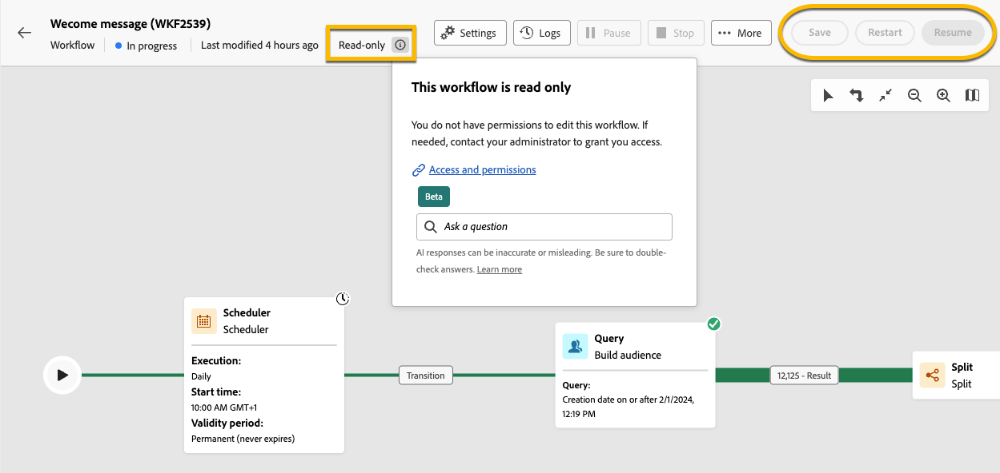
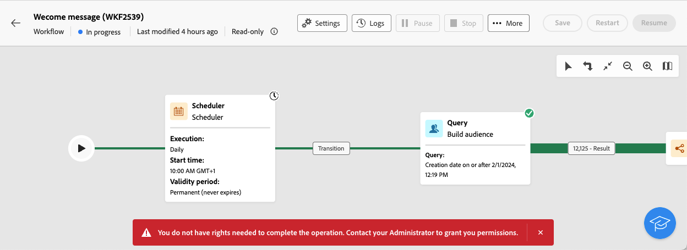

# 关于只读工作流 {#readonly-workflows}

>[!CONTEXTUALHELP]
>id="acw_wf_read_only_canvas"
>title="此工作流为只读"
>abstract="由于您的权限或工作流类型，您无法编辑此工作流。"

某些工作流处于只读状态。 内置的技术工作流始终是只读的，但此重构也可以在其他类型的工作流上激活。

Campaign用户对Adobe Campaign数据的访问权限可能受限。 Campaign管理员可以授予他们查看某些功能的权限，但不能编辑或修改这些功能。 用户对数据的权限是确保数据和流程安全的关键。 在[本节](../get-started/permissions.md)中了解有关Campaign中权限管理的更多信息

当工作流处于只读模式时：

* **[!UICONTROL 设置]**&#x200B;按钮附近的提及&#x200B;**[!UICONTROL 只读]**
* 操作按钮不可访问

{zoomable="yes"}

用户无法在只读工作流中编辑任何内容。 不允许他们更改活动的设置。

{zoomable="yes"}

用户无法删除工作流。

{zoomable="yes"}

## 只读工作流的类型 {#readonly-workflow-types}

根据工作流的类型，只读模式可能不同。

### 活动工作流 {#readonly-campaign-wf}

在只读营销活动工作流的情况下，用户无法访问监视按钮。

{zoomable="yes"}

### 技术工作流 {#readonly-tech-wf}

对于所有Campaign用户（甚至管理员），内置的技术工作流均为只读。 但是，如果需要，用户可以&#x200B;**暂停**&#x200B;或&#x200B;**停止**。 仅允许这些操作。

{zoomable="yes"}

在[本节](https://experienceleague.adobe.com/en/docs/campaign/automation/workflows/introduction/wf-type/technical-workflows)中了解有关技术工作流的更多信息
