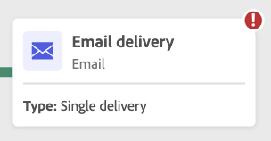

# 启动和监控工作流 {#start-monitor}

创建工作流并设计要在画布中执行的任务后，您可以启动工作流并监视其执行情况。

## 启动工作流 {#start}

要启动工作流，请导航到 **[!UICONTROL 工作流]** 菜单或关联的营销策划，然后单击 **[!UICONTROL 开始]** 按钮进行标记。

工作流运行后，画布中的每个活动都会按顺序执行，直到到达工作流末尾。

您可以使用可视流量实时跟踪目标用户档案的进度。 这允许您快速识别每个活动的状态以及它们之间转换的用户档案数。

>[!NOTE]
>
>您可以使用禁用可视流 **[!UICONTROL 隐藏进度]** 按钮时，可以选择此按钮。

## 监测活动执行 {#activities}

通过每个活动框右上角的视觉指示器，可检查其执行情况：

| 视觉指示器 | 说明 |
|-----|------------|
|  | 当前正在执行活动。 |
|  | 该活动需要您注意。 这可能涉及确认发送投放或采取必要行动。 |
|  | 活动遇到错误。 要解决此问题，请打开工作流日志，以了解更多信息。 |
|  | 已成功执行活动。 |

## 监测日志和任务 {#logs-tasks}

监测工作流日志和任务是分析工作流并确保它们正常运行的关键步骤。 可从以下位置访问它们： **[!UICONTROL 日志]** 图标，该图标位于操作工具栏和每个活动的属性窗格中。

此 **[!UICONTROL 日志和任务]** 菜单提供工作流执行的历史记录，记录所有用户操作和遇到的错误。 此历史记录将在工作流中指定的持续时间内保存 [执行选项](workflow-settings.md). 在此持续时间内，将保存所有消息，即使在重新启动工作流后也是如此。 如果不想保存先前执行的消息，请单击 **[!UICONTROL 清除历史记录]** 按钮。

提供了两种类型的信息：

* 此 **[!UICONTROL 日志]** 选项卡包含所有工作流活动的执行历史记录。 工作流日志按时间顺序对执行的操作和执行错误进行索引。
* 此 **[!UICONTROL 任务]** 选项卡详细介绍了活动的执行顺序。

在这两个选项卡中，您可以选择显示的列及其顺序、应用过滤器，并使用搜索字段快速查找所需信息。

## 工作流执行命令 {#execution-commands}

右上角的操作栏提供了用于管理工作流执行的命令。 您可以：

* **[!UICONTROL 开始]** / **[!UICONTROL 恢复]** 工作流的执行，随后会呈现“进行中”状态。 如果工作流已暂停，则会恢复该工作流，否则会启动该工作流并激活初始活动。

* **[!UICONTROL 暂停]** 工作流执行，随后会呈现“已暂停”状态。 在恢复之前，不会激活任何新活动，但不会暂停正在进行的操作。

* **[!UICONTROL 停止]** 正在执行的工作流，该工作流随后将呈现“已完成”状态。 如果可能，正在进行的操作将会中断。 不能从工作流停止的位置恢复工作流。
